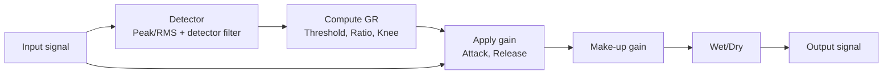
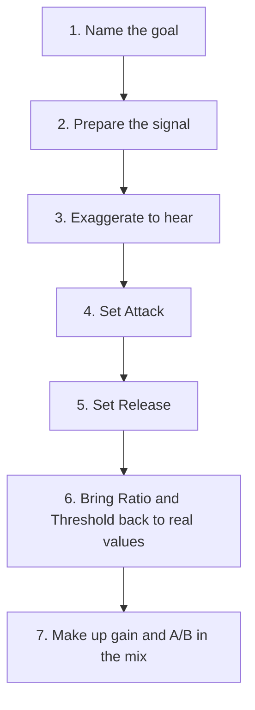

# Compressors in REAPER — Practical Tutorial & Cheat Sheet

Sep 20, 2026 · @Mark

> **In this plugin:** this document owns the compressor settings: ratio, attack, release, knee, GR per source, sidechain and parallel. Signal levels and loudness follow [gain-staging.md](gain-staging.md); reverb ducking follows [reverb.md](reverb.md).
> Written for hands-on work in the REAPER interface. The last section, "Applying in this plugin", maps each step to the MCP tools and the Lua bridge.

## Quick lookup: what you want to know, where to look

A compressor does only one thing: it lowers the level of the part of the signal that goes over the threshold. Punch, glue, sustain and pumping are all consequences of three questions: how much it lowers, how fast, and when it lets go. Every figure in this document is a starting point; your ears are the referee.

| You want to know | Look at |
| --- | --- |
| What a control does, and what it sounds like when set wrong | Part 1 |
| Which type to use: FET, Opto, VCA, Vari-Mu | Part 2 |
| Whether to compress at all, before or after EQ | Part 3 |
| Starting settings for vocals | Part 4A |
| Settings for kick, snare, overheads, drum bus | Part 4B |
| Settings for bass, 808 | Part 4C |
| Settings for guitar, piano, strings, brass, synths | Part 4D |
| Mix bus, master, reverb return, podcast | Part 4E |
| A workflow from zero, and how to compress without ruining the sound | Part 5 |
| Sidechain, parallel, de-ess, multiband in REAPER | Part 6 |
| Complete FX chains by genre | Part 7 |
| You hear a problem and don't know where it comes from | Part 8 |

### Five rules to remember

| Parameter | Light | Medium | Heavy |
| --- | --- | --- | --- |
| Gain Reduction (GR) | 1–3 dB: glue, almost inaudible | 3–6 dB: clear control | 6–10 dB: colour; 10–20 dB only in parallel |
| Ratio | 1.5:1–2:1: glue | 3:1–4:1: control | 6:1–10:1: peak catching; 20:1 and above is effectively a limiter |
| Attack | Above 30 ms: barely touches transients | 10–30 ms: keeps the punch | Below 1–5 ms: squeezes transients, smooths |
| Release | By the song's tempo: 60000 ÷ BPM = ms per quarter note | The GR needle must return close to 0 before the next note | Too fast causes distortion, too slow sounds "squashed" |
| Make-up gain | Always compensate so that compressor on and off are equally loud | The ear always prefers the louder version | Comparing at different levels = wrong decisions |

Note: the same attack/release number is not exactly equivalent across plugins, because each maker measures and designs its detector differently. Watch the GR needle and listen; don't just copy numbers.

## Part 1 — How a compressor works

The part of the signal above the Threshold is lowered according to the Ratio; Attack and Release decide how fast it is lowered and let go. Make-up gain then brings the whole signal back up, so the smaller "body" and the details sound louder. That is why compressed sound feels thicker and closer.



The detector only "listens" to make the decision; the audio you hear takes its own path and is turned down on the detector's orders. Understanding this is understanding sidechain and the detector filter.

### Quick formula

```latex
\text{GR} = (L_{in} - T) \times \left(1 - \frac{1}{R}\right) \quad \text{when } L_{in} > T
```

Example: Threshold −20 dB, Ratio 4:1, input peak −8 dB. It is 12 dB over, 3 dB remains, so GR = 9 dB. For less GR, raise the Threshold or lower the Ratio.

### Parameter by parameter

| Parameter (name in ReaComp) | What it does | Overdone, it sounds like |
| --- | --- | --- |
| Threshold | The level where compression starts. Lower = more of the signal is compressed | Too low: everything is squeezed all the time, lifeless. Too high: the compressor does nothing |
| Ratio | R dB over the threshold comes out as 1 dB | Too high: flat, dead, as if "glued" to the wall |
| Attack | Time to reach full GR | Too fast: punch lost, the sound gets darker and further away. Too slow: peaks slip through, the compression is useless |
| Release | Time to return to GR = 0 | Too fast: pumping, low-end distortion, audible "breathing". Too slow: GR can't recover, the sound gets squashed and quieter and quieter |
| Knee size | Softness around the Threshold. A larger knee = gradual compression that starts even before the threshold | Soft for vocals, buses, acoustic. Hard for drums and peak catching. Wrong: a soft knee on drums makes the punch mushy |
| Wet (make-up) | Makes up the lost level | Too much: you think the compression is "better" just because it is louder |
| Dry | Mixes the original signal back in (parallel) | Too much dry: the compression effect disappears |
| RMS size | 0 ms = pure peak detection; larger values follow the average loudness | Peak: catches every peak, sounds "grabby". RMS 10–50 ms: smooth, ear-like, but lets peaks through |
| Pre-comp | Lookahead: the detector "looks ahead" a few ms | Catches peaks more cleanly, but easily loses natural transients and adds latency |
| Highpass / Lowpass | Filters the signal fed to the detector, not the sound you hear | HPF 80–150 Hz so the low end doesn't trigger compression of the whole track |
| Auto release | The release changes with the material | Usually safe for vocals and buses; less precise when the release has to lock to the beat |

### Two physical rules worth remembering

- **Release by tempo:** 60000 ÷ BPM = ms per beat. At 120 BPM a beat lasts 500 ms, an eighth note 250 ms, a sixteenth note 125 ms. A release equal to or shorter than the gap between two main notes makes the compression "breathe" with the beat.
- **Lows need slow times:** one cycle of a 40 Hz wave lasts 25 ms; at 60 Hz, about 17 ms. An attack/release shorter than one cycle distorts the waveform itself, and it sounds buzzy and muddy.

### Reading the Gain Reduction needle

- The needle moves up and down with the beat and returns near 0 between notes: the compressor is doing its job.
- The needle sits still at a high level: it is compressing constantly; the release is too slow or the threshold too low.
- The needle barely moves: ask yourself again whether you need a compressor.

## Part 2 — Compressor types and tools in REAPER

Choose the type by purpose first, set the numbers later. The compressor type decides its reaction speed and "colour", two things the controls can hardly change completely.

| Type | Character | Suits | Classic model | Free / built-in option |
| --- | --- | --- | --- | --- |
| VCA | Clean, precise, punchy, "glue" | Drum bus, mix bus, kick, snare | SSL G Bus, dbx 160 | ReaComp, TDR Kotelnikov |
| FET | Very fast, aggressive, coloured | Rock/rap vocals, room mics, bass, parallel smash | 1176 | JS 1175 Compressor (Stillwell), Analog Obsession FETish |
| Opto | Slow, smooth, program-dependent release | Vocals, bass, acoustic, piano | LA-2A | Klanghelm DC1A, Analog Obsession LALA |
| Vari-Mu (tube) | Very smooth, warm, the ratio rises with the input level | Mix bus, mastering, ballad vocals, strings | Fairchild 670, Manley Vari-Mu | Klanghelm MJUCjr |
| Transparent digital | No colour, lookahead, precise metering | Technical fixes, podcast, mastering | FabFilter Pro-C 2 | ReaComp |
| Multiband | Compresses each frequency band separately | A problem in one band only: boom, sibilance, harshness | FabFilter Pro-MB | ReaXcomp, TDR Nova (dynamic EQ) |
| Limiter | Infinite ratio, extremely fast attack | Catching peaks at the end of the chain, master loudness | Waves L2 | ReaLimit |

The Stillwell JS plugins ship with REAPER: type "Stillwell" or "1175" into the FX Browser search box. The list of free third-party plugins may change over time, so check the maker's site.

### The built-in trio in REAPER

- **ReaComp:** the workhorse for everything. It has sidechain, detector filters, RMS/Peak, Wet/Dry and auto release. Enough for 80% of situations.
- **ReaXcomp:** multiband, 4 bands by default, and more can be added. Use it when only one frequency region causes the problem.
- **ReaLimit:** a brickwall limiter for the end of the master chain, or for catching peaks on a bus.

### Using ReaComp to imitate each type's "character"

No coloured plugin? Set ReaComp per the table below for similar behaviour. For harmonic colour, add a light saturation plugin after it.

| To resemble | Ratio | Knee | Attack | Release | RMS size |
| --- | --- | --- | --- | --- | --- |
| VCA glue | 2:1–4:1 | 0–6 dB | 10–30 ms | 100–300 ms or Auto | 0–5 ms |
| Aggressive FET | 4:1–8:1 | 0 dB | 0.1–1 ms | 50–100 ms | 0 ms (Peak) |
| Smooth opto | 3:1–4:1 | 10–15 dB | 10 ms | Auto | 20–40 ms |
| Gentle vari-mu | 1.5:1–2:1 | 15–20 dB | 20–30 ms | 300–800 ms or Auto | 20–50 ms |

## Part 3 — When to compress, when not to

Compress only when you can name the problem you are solving. "Everyone compresses" is not a reason; each compressor must answer the question "what am I fixing".

### Seven purposes of compression

| Purpose | Signs you need it | Approach |
| --- | --- | --- |
| Dynamics control | Phrases alternately loud and quiet, words get buried | 3:1–4:1, GR 3–6 dB, medium attack |
| Peak catching | A few notes or hits jump out suddenly | 6:1–10:1, fast attack, touching only the peaks |
| Adding punch | Kick, snare, bass lack impact at the note start | A slow attack of 10–30 ms so the transient gets through |
| Adding sustain and thickness | A clean guitar that dies quickly, a thin snare, a room mic | Fast attack, fast release, lots of GR, or parallel |
| Glue | A group of instruments sounds disjointed | Bus compressor 2:1, GR 1–3 dB |
| Making room (ducking) | Bass stepping on the kick, music covering the voice | Sidechain (Part 6) |
| Loudness and peak protection | The master needs loudness without clipping | A limiter at the end of the chain |

### When NOT to compress

- The sound is already even: synth pads, processed samples, heavily distorted guitar.
- The problem is in a few words or sections only: item volume or automation is cleaner.
- The problem is frequency (boom, harshness, sibilance): use EQ, dynamic EQ or multiband.
- The genre needs natural dynamics: classical, acoustic jazz, film music. Compress very lightly or not at all.
- Switching it on and off at equal level makes no audible difference: remove the plugin.

### By stage

| Stage | Compress for | GR | Tip in REAPER |
| --- | --- | --- | --- |
| Recording | A comfortable headphone mix for the singer; usually not printed to the file | 0 dB on the recorded file | Put the comp in Track FX instead of Input FX: the singer hears the compression, the recorded file stays clean. Recording peaks around −12 to −6 dBFS ([gain-staging.md](gain-staging.md), section 4) |
| Preparation / editing | Balancing phrases before compressing, lowering breaths and unusual peaks | No comp | Split items and drag the volume of each item, or use a Take volume envelope |
| Mix — track | Control and tone for each source | 2–8 dB depending on the source | Part 4 |
| Mix — bus | Gluing groups: drums, vocals, guitars | 1–4 dB | A folder track is a bus |
| Mix — master bus | Gluing the whole song; you can mix "into" the comp early | 1–3 dB | Put it on the Master track |
| Mastering | Light dynamics adjustment, then a limiter | 0.5–2 dB + limiter | Render the mix to a file, then master it in a separate project |

### Order in the FX chain


This is the safe default order for most sources. The reason for each step:

- **Corrective EQ before the comp:** so the comp does not react to hum, floor rumble or room resonances.
- **Boosting EQ after the comp:** boost before it and the comp "eats" what you just boosted and changes how it compresses.
- **Exception:** deliberately boost before the comp when you want it to react more strongly to a band.
- **De-esser after the comp:** the comp makes the vowels quieter, so the "s" sounds stand out. If a very harsh "s" makes the comp jump around, add another de-esser before the comp.
- **Gate before the comp (drums):** the comp pulls up bleed and noise, so block them first.
- **Two light comps instead of one heavy one:** an FET catching peaks at 2–4 dB, then an Opto smoothing at 2–4 dB. That sounds more natural than one comp compressing 8 dB.

### Compressors and reverb

- **Compress before the reverb:** use a post-fader send from the compressed track. The reverb receives an even signal, so its tail is even.
- **Avoid a comp after a reverb on the same track:** the reverb tail gets pulled up; the mix gets dirty and distant.
- **A comp on the reverb return:** deliberate, for a thicker and longer tail (ambient, big rock).
- **Duck the reverb with the vocal:** the reverb gets quieter while the singer sings and blooms in the gaps. The voice stays clear and still "wet" (settings in Part 4E, Part 6 and [reverb.md](reverb.md), section 11.3).

## Part 4A — Vocals

The vocal needs to stay put at the front of the mix while keeping its emotion. The safest approach: balance the phrases with item volume first, then use two light comps in series, 2–4 dB each.

| Source | Type | Ratio | Attack (ms) | Release (ms) | GR (dB) | Notes |
| --- | --- | --- | --- | --- | --- | --- |
| Pop lead, one comp | Opto or VCA | 3:1–4:1 | 5–15 | 50–150 or Auto | 3–6 | Knee 6–10 dB, RMS 5–20 ms |
| Lead, comp 1 (peak catching) | FET | 4:1–8:1 | 0.5–3 | 50–100 | 2–4, peaks only | Hard knee, Peak |
| Lead, comp 2 (smoothing) | Opto | 3:1 | \~10 | Auto | 2–4, continuous | Soft knee, RMS 20–30 ms |
| Rap | FET | 4:1–6:1 | 1–5 | 40–80 | 5–8 | Fast flow: release 40–60 ms so it doesn't smear into the next word |
| Ballad, acoustic | Opto or Vari-Mu | 2:1–3:1 | 15–30 | 100–300 or Auto | 2–4 | Keep the emotion; rely more on automation |
| Rock, scream | FET, in series | 6:1–10:1 | 1–3 | 50–100 | 6–10 | Usually needs 2 comps + parallel |
| Backing vocals, harmonies | VCA or FET | 4:1–8:1 | 3–10 | 50–100 | 6–10 | Compress hard so they stay put at the back |
| Doubles, ad-libs | VCA or FET | 4:1–6:1 | 3–10 | 50–100 | 5–8 | Like backing vocals, placed lower than the lead |
| Vocal bus (lead + doubles) | VCA or Opto | 2:1 | 10–30 | Auto | 1–2 | Glues the vocal layers together |
| Parallel vocal (modern pop) | FET | 8:1–20:1 | Fastest | 50–100 | 10–15 | Blend 10–15 dB below the lead for thickness |

### Keep, don't break

- **Consonants at the start of words:** an attack under 3 ms on a single comp easily kills intelligibility. If the words smear, raise the attack to 10–15 ms.
- **Dynamics between verse and chorus:** a comp cannot replace automation. Make the chorus louder with volume; don't let the comp flatten the whole song.
- **Natural breaths:** heavy compression pulls the breaths up. Lower the item volume of each breath by 6–10 dB instead of gating.
- **The studio's air:** the heavier the compression, the more room sound and noise come up. That is the natural limit of GR.

### Practical tips

- Turn on ReaComp's Highpass detector at 100–150 Hz so plosives (p, b) don't trigger compression.
- A singer moving in front of the mic shifts the level by 6–10 dB: fix it with item volume; don't make the comp carry it.
- If the "s" sounds jump out after compressing: add a de-esser (Part 6).
- The vocal still doesn't "sit" in the mix after 6 dB of compression: that is usually an EQ problem, or the music being too dense at 1–4 kHz, not a lack of compression.

## Part 4B — Drums

With drums, Attack decides the punch and Release decides the groove. A slow attack pushes the drums forward and makes them hit harder; a fast attack pushes them back and smooths them.

| Source | Type | Ratio | Attack (ms) | Release (ms) | GR (dB) | Notes |
| --- | --- | --- | --- | --- | --- | --- |
| Kick — punch | VCA or FET | 4:1 | 10–30 | 50–100, by tempo | 3–6 | Hard knee; GR must return to 0 before the next hit |
| Kick — control (metal, even material) | FET | 4:1–8:1 | 1–5 | 50–80 | 4–8 | Blending in a sample is often more effective than heavy compression |
| Snare — crack | VCA or FET | 4:1 | 5–20 | 50–150 | 3–6 | Attack 5 ms: smooth; 20 ms: hard-hitting |
| Snare — fat, ringing | FET | 6:1–8:1 | 0.5–3 | 30–80 | 6–10 | Or do it with parallel |
| Toms | VCA | 4:1 | 10–20 | 100–200 | 3–6 | Delete the stretches where the toms don't play before compressing |
| Overheads | VCA or Vari-Mu | 2:1 | 20–40 | 100–250 | 1–3 | Often not needed; watch for cymbals getting "sucked" |
| Room mic | FET | 10:1–20:1 | 0.1–1 | 50–150, by tempo | 10–20 | Crush it, then blend it low; "breathing" with the beat is intended |
| Hi-hat | VCA | 2:1–3:1 | 5–10 | 50–100 | 1–3 | Usually needs only EQ or automation |
| Drum bus — glue | VCA | 2:1–4:1 | 10–30 | 100–300 or Auto | 2–4 | Highpass detector 80–150 Hz so the kick doesn't trigger the whole bus |
| Drum bus — parallel (New York) | FET or VCA | 8:1–20:1 | 0.1–1 | 50–150 | 10–20 | Blend 10–30%; you can EQ the lows and highs up on the compressed branch |
| Loops, drum samples | VCA | 2:1 | 10–30 | Auto | 1–2 | Usually already compressed; just light glue |

### Keep, don't break

- **The transient at the start of each hit:** lose it and you lose the punch. If it sounds "squashed", raise the attack 5 ms at a time.
- **The gaps between hits:** a release that is too slow fills the gaps, and the groove loses its breathing.
- **Steady cymbals:** a kick triggering compression on the bus pulls the cymbals down with it, as if they were "sucked".
- **The overheads' stereo image:** compress in stereo with the detector in L+R mode (the default), not the two channels separately.

### Practical tips

- Set the release by eye: the GR needle returns to 0 just before the next hit. At 90 BPM an eighth note lasts about 333 ms.
- A snare mic with a lot of hi-hat in it: compression will pull the hi-hat up. Gate it or cut with EQ first, or lean on a sample.
- A crushed room mic is the cheapest source of "size" in rock. Blend it in from the start, then push it up until it is just audible.
- In REAPER, create a "Drums" folder track holding every drum mic; the FX on that folder is the drum bus.

## Part 4C — Bass and 808

The number-one goal for bass is that every note is even, so that the song's low end has no holes and no bulges. The vital rule: don't set the release below about 25 ms, because one cycle of the lowest E (41 Hz) already lasts about that long.

| Source | Type | Ratio | Attack (ms) | Release (ms) | GR (dB) | Notes |
| --- | --- | --- | --- | --- | --- | --- |
| Bass DI, fingerstyle | Opto | 4:1 | 10–30 | 100–300 or Auto | 3–6 | RMS 10–30 ms, soft knee |
| Picked bass | VCA or FET | 4:1 | 5–15 | 80–200 | 4–6 | A slower attack if you want to hear the pick clearly |
| Slap bass | FET | 6:1–8:1 | 0.5–3 | 50–100 | 6–10 | Slap peaks are very high; it often needs 2 stages |
| Serial, stage 1 | FET | 8:1 | 0.5–2 | 50–100 | 2–4, peaks only | Catches the notes that jump out |
| Serial, stage 2 | Opto | 4:1 | \~10 | Auto | 3–4 | Smooths and thickens |
| Bass amp / mic | Opto or VCA | 3:1 | 10–30 | 100–250 | 2–4 | The amp already compresses a little; go lighter than on the DI |
| Synth bass | VCA | 2:1 | 10–30 | 100–200 | 0–2 | Usually already even; the main job is ducking to the kick |
| 808 | VCA | 2:1–4:1 | 20–30 | 150–300 | 2–4 | Keep the click at the note start; saturation + limiter are used more often than a comp |
| Ducking to the kick (sidechain) | VCA | 4:1 | 0.1–1 | 50–120 | 2–4 | Detector = Auxiliary input, fed by the kick |

### Keep, don't break

- **A clean low end:** an attack or release that is too fast distorts the waveform, and it sounds buzzy and muddy.
- **The pluck, the pick attack:** that is what makes the bass audible on small speakers. An attack under 5 ms on fingerstyle bass erases it.
- **The groove with the kick:** ducking too deep makes the bass "hiccup" with the beat, unless you mean it (EDM).

### Practical tips

- Low E notes much louder than the high notes: use ReaXcomp to compress only the 40–120 Hz band, or lower the item volume of individual notes.
- A comp before the amp sim: more even drive. A comp after the amp sim: control of the final level. You can use both.
- To give the bass some "bite" while keeping the lows clean: a parallel branch with a hard-driven FET + distortion, everything below 200 Hz cut, blended low.
- A long 808 overlapping the kick: duck the 808 to the kick by 3–6 dB, or shorten the 808 notes.

## Part 4D — Guitar, piano, keys, strings, brass, synths

This group usually needs less compression than vocals and drums. The denser the mix, the more compression it takes to stay put; the sparser the arrangement, the more it should breathe naturally.

| Source | Type | Ratio | Attack (ms) | Release (ms) | GR (dB) | Notes |
| --- | --- | --- | --- | --- | --- | --- |
| Heavily distorted electric guitar | VCA | 2:1–3:1 | 10–30 | 100–200 | 0–2 | Distortion is already compression; usually skip it |
| Crunch guitar | VCA or FET | 3:1 | 10–20 | 100–150 | 2–4 | Keep the pick attack |
| Clean guitar | VCA or Opto | 3:1–4:1 | 5–15 | 80–150 | 3–5 | Adds sustain, evens out the chords |
| Funk, chop guitar | FET | 4:1–6:1 | 1–5 | 50–80 | 4–8 | An even "squash" is part of the genre |
| Guitar solo | Opto or FET | 3:1–4:1 | 10–20 | 100–200 or Auto | 3–5 | More sustain; high notes don't jump out |
| Acoustic — strumming | Opto | 2:1–4:1 | 10–25 | 100–200 or Auto | 2–5 | Highpass detector 100–200 Hz so the body resonance doesn't trigger compression |
| Acoustic — fingerpicking | Opto | 2:1–3:1 | 15–30 | Auto | 2–3 | Keep the string touch |
| Piano, pop and rock | VCA or Opto | 3:1–4:1 | 10–30 | 100–200 | 3–6 | Needs to be even in a dense mix so it doesn't get lost |
| Piano, ballad and solo | Opto or Vari-Mu | 1.5:1–2:1 | 20–40 | 200–400 or Auto | 1–3 | Keep the player's phrasing |
| Rhodes, electric piano | Opto | 3:1 | 10–20 | Auto | 2–4 | Smooth and warm |
| Organ | — | — | — | — | 0 | Already even; use automation |
| Strings, orchestra | Vari-Mu or Opto | 1.5:1–2:1 | 30–50 | 300–600 or Auto | 1–3 | Or automation only |
| Brass section | FET or VCA | 3:1–4:1 | 5–15 | 80–150 | 3–5 | Keep the sharp note starts |
| Sax solo | Opto | 3:1 | 10–20 | Auto | 3–6 | Treat it like a vocal |
| Synth lead, pluck | VCA | 2:1–3:1 | 5–15 | 50–100 | 0–3 | Only when the velocities vary a lot |
| Pad | VCA | 4:1 | 0.1–1 | By tempo | 3–6 when ducking | Needs no regular compression; only ducking to the kick |
| Percussion (conga, tambourine) | VCA | 3:1–4:1 | 1–10 | 50–100 | 2–5 | A shaker usually doesn't need it |

### Keep, don't break

- **Distorted guitar:** extra compression takes away the drive and pulls up the amp's hum and hiss.
- **Acoustic:** the pick noise, the string touch and the air of the body are the soul of the instrument.
- **Piano:** a release that is too fast makes the pedal tail swell with every note, as if it were "pumping".
- **Strings, orchestra:** crescendos are their nature; flattening them erases the arranger's intent.
- **Synths:** the accented velocities create the groove; don't flatten them.

### Practical tips

- L/R guitar doubles: compress them identically, or send them to a guitar bus and compress them together by 1–3 dB.
- Stereo sources (piano, overheads, pads): keep the detector in L+R mode so the stereo image doesn't drift.
- An acoustic in a dense band: compress 4–6 dB and cut the lows hard. An acoustic accompanying a vocal on its own: 1–3 dB is enough.

## Part 4E — Buses, mix bus, master, reverb return, podcast

The closer to the end of the chain, the less compression. A mix bus that needs more than 3 dB of GR is usually a sign that the mix balance is not right yet, so go back and fix the individual tracks.

| Source | Type | Ratio | Attack (ms) | Release (ms) | GR (dB) | Notes |
| --- | --- | --- | --- | --- | --- | --- |
| Mix bus — glue | VCA | 1.5:1–4:1 (2:1 is common) | 10–30 | Auto or 100–300 | 1–3 | An attack of 30 ms keeps the drum punch; detector HPF 60–100 Hz if the lows trigger too much compression |
| Mix bus — warm, smooth | Vari-Mu | 1.5:1–2:1 | 20–50 | Auto | 1–2 | Suits ballads, acoustic, lo-fi |
| Guitar, keys, backing vocal bus | VCA | 2:1 | 10–30 | Auto | 1–3 | Glues the layers of one group |
| Mastering comp | VCA or Vari-Mu | 1.5:1–2:1 | 10–30 | Auto or 100–300 | 0.5–2 | Soft knee |
| Master limiter (ReaLimit) | Limiter | ∞ | Very fast | 50–200 | 1–4 on peaks | Ceiling −1 dBTP, true peak on |
| Reverb return — thick tail | VCA or Opto | 3:1–4:1 | 10–30 | 100–300 | 3–6 | For ambient, big rock |
| Reverb/delay ducked by the vocal | VCA | 2:1–4:1 | 5–20 | 150–400 | 3–6 | Sidechain from the vocal; a long release so the tail blooms in the gaps. Per [reverb.md](reverb.md), section 11.3 |
| Podcast, voice-over | VCA or Opto | 3:1–4:1 | 5–10 | 50–100 or Auto | 4–8 | Followed by a limiter at −1 dBTP |
| Advertising, radio | FET + Opto in series | 4:1–8:1 | 1–10 | 50–100 | 6–10 in total | Dense, loud, close to the ear |
| Film and video dialogue | Opto or VCA | 2:1–3:1 | 5–15 | 50–150 | 2–5 | Prefer automation, keep it natural |
| Impact SFX, foley | — | — | — | — | 0–2 | Transients are everything; usually only a peak-protecting limiter |
| Ambience, backgrounds | — | — | — | — | 0 | Already even; duck to the dialogue only if needed |

### Loudness at export

Streaming platforms normalise loudness automatically: Spotify and YouTube around −14 LUFS, Apple Music around −16 LUFS; podcasts usually aim for about −16 LUFS. The full per-platform table, with sources, is in [gain-staging.md](gain-staging.md), section 9; platforms can change their policies, so check again before delivering a file. Pushing much louder than that only gets the song turned down, and it loses punch.

- Measuring loudness in REAPER: add the built-in loudness meter (search "Loudness Meter" in the FX Browser) to the Master.
- Or use "Dry run" in the Render window to see LUFS and true peak without exporting a file.

### Keep, don't break

- **The drum transients on the mix bus:** an attack under 10 ms on the mix bus is the quickest way to rob the whole song of its punch.
- **The lift of the chorus:** a heavy master comp pulls the verse up and pushes the chorus down, and the song loses its climax.
- **Headroom for mastering:** if someone else masters it, also export a version without the limiter on the Master.

### Practical tips

- Mix "into" the mix bus comp early, after the basic balance. Adding it at the very end shifts the balance you have built.
- Ducking reverb: create a reverb track, put ReaComp after the reverb, and send the vocal additionally into channels 3/4 of that track (method in Part 6).

## Part 5 — A 7-step workflow, and compressing without ruining the sound

Exaggerate first to hear clearly, then pull back to the real setting. That way you hear what the attack and release are doing instead of turning knobs blindly.



1. **Name the goal.** Control, punch, sustain, glue or making room? Choose the compressor type per Part 2.
2. **Prepare the signal.** EQ out the junk, balance phrases with item volume. Analog-modelled plugins like an average input around −18 dBFS; set it with JS: Volume Adjustment placed in front of them.
3. **Exaggerate to hear.** Ratio 8:1 or more, the fastest attack, a fast release. Lower the Threshold until GR is 10–15 dB.
4. **Set the Attack.** Increase it from the fastest until the transient or consonant comes back as much as you want.
5. **Set the Release.** Until the GR needle "breathes" with the beat and returns near 0 before the next note, with no odd pumping.
6. **Bring it back to real values.** Set the Ratio per the tables in Part 4, then raise the Threshold until GR is on target.
7. **Make up gain and A/B.** Adjust Wet (make-up) until on and off are equally loud. Compare with the whole mix playing, not only in solo.

### Techniques for compressing without breaking things

The root principle: automation handles changes at the section level, the compressor handles changes at the note level. Giving section-level work to a comp is the most common reason a sound gets killed.

| Technique | Solves | How |
| --- | --- | --- |
| Item volume first | The comp has to compress too deep because phrases differ a lot | Split items, drag the volume of each part until they are close |
| Serial | One comp at 8–10 dB sounds choked | 2–3 comps at 2–4 dB each, the fast type first, the slow type after |
| Parallel | You want thickness but also the transients | Blend a heavily compressed version with the original (Part 6) |
| Slow attack | Punch lost, consonants lost | Raise the attack 5 ms at a time until the note start comes back |
| Detector filter | The lows or plosives trigger compression of the whole track | Highpass detector 80–150 Hz |
| Soft knee + RMS | The compression sounds obvious, "grabby" | Knee 6–15 dB, RMS 10–30 ms |
| Auto release | The source is alternately dense and sparse, and one release doesn't fit | Turn on Auto release |
| Multiband / dynamic EQ | The problem is in one band only | ReaXcomp or TDR Nova, compressing only that band |
| Sidechain ducking | Two sources fight for space | Lower the secondary source while the main one plays, instead of compressing both |
| Compressing on the bus | Compressing each track hard makes everything flat | Each track light, the bus adds 1–3 dB of glue |
| A clipper for very short peaks | A comp with a very fast attack takes the power out of drums | Clip 1–3 dB off the peaks with a clipper (type "clip" in the FX Browser) |
| Comparing at the same level | Thinking the compression is better just because it is louder | Match with Wet first, then switch on and off |
| Resting your ears | Ears get used to overdone compression | Rest for 10 minutes, then listen again at a low volume |

## Part 6 — Hands-on in REAPER

ReaComp plus REAPER's routing can do every common compression technique without paid plugins. Menu names may differ slightly between REAPER versions.

### ReaComp: the controls worth knowing

- **Auto make-up:** convenient, but its estimate is imprecise. Better to turn it off and set Wet yourself for a fair comparison.
- **Limit output:** stops the output from going over 0 dBFS; a safety net when making up a lot of gain.
- **Detector input:** Main input for normal compression; Auxiliary input for a sidechain from channels 3/4.
- **Preview filter:** hear the detector signal itself after filtering. Use it to find the frequency region when de-essing.
- **The FX window's Wet/Dry knob:** every plugin in REAPER has its own mix knob on the top bar of the FX window, usable for parallel compression.
- **Saving a preset:** the "+" button next to the preset box → Save preset. Name it by purpose, for example "Vocal — FET peak catch".

### Sidechain ducking (example: the kick pushes the bass back)

1. Insert ReaComp on the **Bass** track.
2. Open the Routing of the **Kick** track → Add new send → choose Bass. (Or drag the Kick's Route button onto the Bass track.)
3. In the new send, change the Audio destination from 1/2 to **3/4**. If Bass doesn't have 4 channels yet, open Bass's Routing and set Track channels = 4.
4. Set the send to Pre-Fader (Post-FX), so that moving the kick fader doesn't change the amount of ducking.
5. In ReaComp: Detector input = **Auxiliary input L+R**.
6. Ratio 4:1, attack 0.1–1 ms, release 50–120 ms. Lower the Threshold until GR is 2–4 dB on each kick.
7. Check: the GR needle jumps exactly on each kick and returns to 0 before the next one.

The same method works for: vocals ducking backing music, vocals ducking reverb/delay, speech ducking podcast music, the kick ducking pads in EDM.

**Ghost trigger (EDM):** create a "ghost" kick track that plays evenly on every beat, and untick **Master send** so it doesn't reach the speakers. Send it into channels 3/4 of the pads, bass and chords: the pumping keeps running even in sections without a kick.

### Parallel compression: 3 ways

| Way | How | When |
| --- | --- | --- |
| Dry/Wet in ReaComp | Raise Dry (for example to 0 dB), compress hard, adjust Wet to blend | Quick, for a single track |
| The FX window's Wet/Dry knob | Turn the percentage mix knob of any plugin | When the plugin has no Mix control of its own |
| A separate bus | Create a "Drum Smash" track, send the drum tracks to it, put a comp on it 100% wet, EQ the compressed branch separately, blend with the fader | The most flexible; the blend can be automated |

REAPER 7 and later also have FX Containers and an option to run FX in parallel within an FX chain (right-click an FX to find it). REAPER compensates plugin latency automatically, so a parallel branch does not drift out of phase unless a plugin reports its latency wrongly.

### De-essing in REAPER

| Way | Settings | Pros and cons |
| --- | --- | --- |
| ReaComp + detector filter | Highpass detector 4–9 kHz; turn on Preview filter to find the "s" region, then turn it off. Ratio 4:1–6:1, attack 0.1–1 ms, release 30–60 ms, GR 3–6 dB only on the "s" | Easy; but it lowers the whole band, and overdoing it makes the voice "drop out" on words with an s |
| ReaXcomp, one band | Compress only the 5–10 kHz band; leave the other bands at ratio 1:1 | More transparent; touches only the harsh region |
| A de-esser or dynamic EQ | Search "de-ess" in the FX Browser, or use TDR Nova | The fastest and most precise |

Male voices usually have lower "s" sounds than female voices; always find the region by ear rather than trusting a number.

### Multiband with ReaXcomp

- 4 bands by default; drag the crossover points to match the problem region.
- Compress only the band that needs it; leave the other bands at ratio 1:1.
- Use it for: the 40–120 Hz boom of a bass, the 200–400 Hz boxiness of an acoustic guitar, the 2–5 kHz harshness of a distorted guitar, the "s" of a vocal.
- Careful on the master: heavy-handed multiband easily skews the tonal balance of the whole song.

### Workflow tips

- Save the whole chain: in the FX window, FX menu → Save FX chain. Reuse the vocal chain in the next song.
- Save a Track template when you want to keep both the FX and the routing (for example a reverb track with a 4-channel sidechain already set up).
- Toggle an FX quickly with the checkbox next to its name in the FX chain, for A/B.

## Part 7 — Example FX chains by genre

Each chain below is a starting point with the total compression already balanced. Save it as an FX chain in REAPER, then adjust it for the song.

| Genre | Source | FX chain (in order) |
| --- | --- | --- |
| Pop | Lead vocal | HPF 80–100 Hz → FET 6:1, attack 1 ms, release 60 ms, 2–3 dB on peaks → Opto 3:1, Auto, 3 dB → De-esser → tone EQ → light saturation. Sends: plate reverb and a 1/8 delay, both ducked by the vocal |
| Pop | Vocal bus | VCA 2:1, attack 20 ms, Auto, 1–2 dB |
| Rap | Lead vocal | HPF → FET 4:1, attack 3 ms, release 50 ms, 5–6 dB → De-esser → EQ → a parallel FET 20:1 branch blended low |
| Rock | Kick | Gate → corrective EQ → VCA 4:1, attack 20 ms, release 60 ms, 4 dB |
| Rock | Snare | Gate → corrective EQ → FET 4:1, attack 10 ms, release 80 ms, 5 dB |
| Rock | Room | EQ → FET 20:1, fastest attack, release by tempo, 15 dB, blended low |
| Rock | Drum bus | VCA 4:1, attack 30 ms, Auto, 3 dB, HPF detector 100 Hz + a parallel smash bus blended at 20% |
| Rock | Bass | HPF 30 Hz → FET 8:1 catching peaks, 3 dB → Opto 4:1, 3 dB → EQ → light ducking to the kick, 2 dB |
| Ballad, acoustic | Acoustic guitar | HPF → Opto 3:1, attack 20 ms, Auto, 3 dB, HPF detector 150 Hz → EQ |
| Ballad, acoustic | Vocal | HPF → Opto 2:1–3:1, attack 15 ms, Auto, 3 dB → De-esser → EQ; the rest with automation |
| Ballad, acoustic | Piano | Opto 2:1, attack 30 ms, Auto, 2 dB |
| Ballad, acoustic | Mix bus | Vari-Mu 1.5:1, attack 30 ms, Auto, 1 dB |
| EDM, electronic pop | Kick | No comp, or a clipper cutting 1–2 dB off the peaks |
| EDM, electronic pop | Bass, pads, chords | ReaComp sidechained from a ghost kick, 4:1, attack 0.1 ms, release by tempo, 4–8 dB |
| EDM, electronic pop | Mix bus | VCA 2:1, attack 30 ms, Auto, 2 dB → limiter |
| Podcast | Voice | HPF 80 Hz → noise reduction if needed → Opto or VCA 3:1, attack 5–10 ms, Auto, 4–6 dB → De-esser → EQ → ReaLimit ceiling −1 dBTP |
| Podcast | Background music | Sidechained from the voice, 4:1, attack 10 ms, release 300–500 ms, 6–10 dB |
| All genres | Master | Light EQ → VCA 2:1, attack 30 ms, Auto, 1–2 dB → optional saturation/tape → ReaLimit ceiling −1 dBTP |

## Part 8 — Troubleshooting: you hear X, adjust Y

Most compression mistakes come from three things: the wrong attack, the wrong release, or too much GR. Find the symptom in the first column and fix it per the last column.

| You hear | Common cause | Fix |
| --- | --- | --- |
| Punch lost, note starts "squashed" | Attack too fast | Raise the attack by 5–10 ms, reduce GR, or switch to parallel |
| Lyrics less intelligible | The attack squeezes out the consonants | Attack 10–15 ms |
| Unwanted pumping, cymbals or pads "sucked" | Release off the beat, lows triggering compression, too much GR on a bus | Release by tempo, Highpass detector 80–150 Hz, reduce GR |
| The whole bus bobs with the kick | The kick dominates the detector | Highpass detector 80–150 Hz |
| Bass or 808 buzzes, distorts | Attack/release shorter than the cycle of the low frequencies | Release above 50–100 ms, attack above 10 ms, a larger RMS size |
| Flat, dead, tiring sound | Too much GR, a high ratio, the comp doing the job of automation | Reduce GR, split into serial or parallel, use automation at the section level |
| The sound gets quieter and further away after a few phrases | Release too slow, GR builds up and never returns to 0 | A faster release, or Auto release |
| "S", "x", "ch" harsher after compressing | The comp lowers the vowels, so the sibilants stand out | A de-esser after the comp |
| Breaths, room sound and noise get louder | Make-up gain pulls the quiet parts up too | Lower the item volume of the breaths, reduce GR, a light gate if needed |
| A "click" or distortion at note starts | A very fast attack with large GR, or lookahead | Raise the attack, reduce GR, turn Pre-comp off |
| The vocal sounds harsh and gritty under heavy compression | One FET carrying too many dB | Split into two stages, FET + Opto, 2–4 dB each |
| The stereo image drifts left and right | The two channels are compressed independently | Detector L+R (linked) |
| A thin snare, lacking body | Not enough sustain | Fast attack, fast release, more GR, or parallel |
| Kick and bass fight, the low end is boomy | Both occupy the same band at the same moment | Duck the bass to the kick by 2–4 dB, EQ them into separate regions |
| The chorus doesn't lift above the verse | Bus or master comp too heavy | Reduce the bus GR to 1–2 dB, lift the chorus with automation |
| A loud, dirty reverb tail | A comp after the reverb on the same track | Comp first, reverb through a send; duck the reverb to the vocal |
| The GR needle stays still, no audible difference | Threshold too high | Lower the Threshold, or remove the plugin if it isn't needed |
| Turning the comp on sounds "better" but the mix gets worse | Comparing at unequal levels, listening in solo | Match the gain, then A/B with the whole mix playing |

## Checklist before settling on a compressor

- [ ] I can name the job this compressor is doing.
- [ ] Phrases and sections are already balanced with item volume or automation.
- [ ] Corrective EQ sits before the comp.
- [ ] The GR needle moves with the beat and returns near 0 between notes.
- [ ] GR is within the target range of Part 4; above 6 dB, consider splitting into serial or parallel.
- [ ] Transients, consonants and the string touch are still there.
- [ ] No low-end distortion, no unwanted pumping.
- [ ] On and off are equally loud, and the "on" version really is better with the whole mix playing.
- [ ] Buses and the master at only 1–3 dB GR; the chorus still lifts above the verse.
- [ ] Master: ceiling −1 dBTP, loudness suited to the release platform.
- [ ] A preset or FX chain saved for reuse.

## Applying in this plugin

Claude does not turn knobs: parameters are set through a tool or the Lua bridge, and the result must be measured again rather than trusting a tool's "success" report.

| Step in this document | How to do it in the plugin |
| --- | --- |
| Add ReaComp, ReaXcomp, ReaLimit | `add_fx`; on the Master use `add_master_fx`, or `apply_limiter` for ReaLimit |
| Set Threshold, Ratio, Attack, Release, Knee, RMS size, detector filters, Dry, Wet | ReaComp and ReaLimit parameter indices are in [plugin-control.md](../../../reaper-mcp/references/plugin-control.md), "Stock Cockos plugins". `set_fx_parameter` takes normalised 0–1 values, not dB or ms: set values by their displayed value with the binary search in the same document |
| Third-party compressors (FET, Opto, Vari-Mu) | Dump the parameter names and values before setting anything ([plugin-control.md](../../../reaper-mcp/references/plugin-control.md), "Find the parameter first") |
| Release by tempo | The tempo from `get_project_info`; onset spacing from `analyze_transients` ([audio-mixing.md](../audio-mixing.md), section 10) |
| Check what the comp is doing | Crest factor and LUFS before and after, on a rendered stem, compared at the same loudness ([audio-mixing.md](../audio-mixing.md), sections 3 and 10) |
| Sidechain (kick → bass, vocal → reverb, ghost kick) | `create_send`, then Lua: the destination track's `I_NCHAN` ≥ 4, the send's `I_DSTCHAN` = 2 (channels 3/4), and the plugin's pin mapping. Check all three conditions in [plugin-control.md](../../../reaper-mcp/references/plugin-control.md), "Sidechain routing" |
| Send mode (Pre-Fader, Post-Fader, Pre-FX) | Lua `I_SENDMODE`: 0 post-fader, 1 pre-FX, 3 post-FX before the fader. `create_send` uses the default from REAPER's Preferences |
| A ghost trigger track that doesn't reach the speakers | Lua `B_MAINSEND` = 0 on that track |
| Parallel compression on a separate bus | `create_track`, `create_send`, `add_fx`, balance with `set_track_volume` |
| Toggling for A/B | `bypass_fx` |
| Presets, FX chains | Load an existing preset with `load_fx_preset`; saving presets and FX chains is an interface action |
