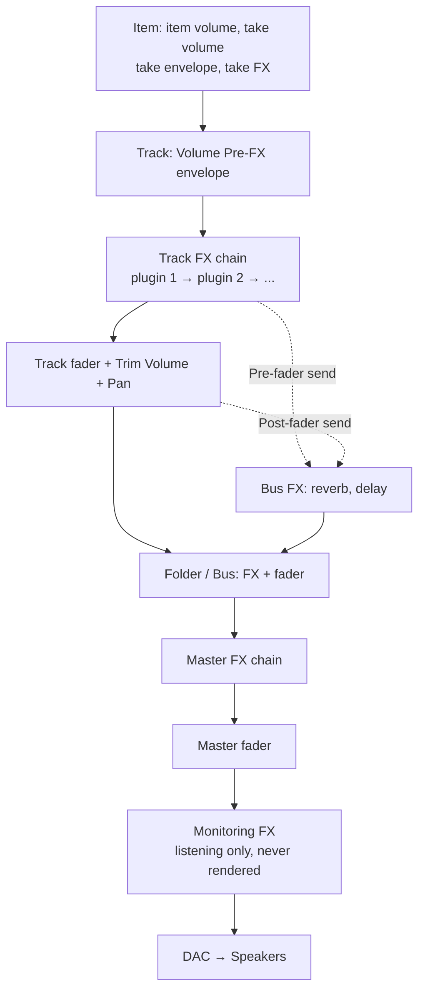

# Gain Staging in REAPER — Practical Tutorial & Cheat Sheet

Sep 19, 2026 · @Mark

> **In this plugin:** this document owns the numbers for signal levels, meters, headroom and delivery loudness. Where another document gives different figures for these, this one wins.
> Written for hands-on work in the REAPER interface. The last section, "Applying in this plugin", maps each step to the MCP tools and the Lua bridge.

## 1. Core ideas

Gain staging means keeping the signal at each point of the processing chain inside that point's best working range. The goal is not "loud" or "quiet" but the four things below, which frame the whole document.

1. **Safe:** no clipping at the ADC, in plugins, on buses or in the exported file.
2. **In the sweet spot:** each plugin receives the level it was calibrated for.
3. **Comfortable controls:** faders sit around −10 to +5 dB, not stuck at −30 or +12.
4. **Fair comparisons:** switch plugins on and off at the same loudness, because the ear always thinks louder is better.

### REAPER processes in floating point — so why gain stage at all?

REAPER processes internally in 64-bit floating point. A track that goes over 0 dBFS in the middle of the chain is not really clipped; bring it down later and it is intact. But there are four places where clipping or distortion is real:

- **The ADC while recording:** anything over 0 dBFS is lost for good and cannot be recovered.
- **Analog-modelled plugins** (comp, tape, console, preamp, amp sim): they react to the input level. A hot input means more distortion and compression than you intended.
- **Plugins with an internal clipper/limiter**, or fixed-point processing.
- **The DAC to the speakers, and 16/24-bit integer renders:** anything over 0 dBFS clips.

### Gain ≠ Volume — the most important thing in REAPER

**Gain** is the level going INTO a processor; **volume** is the level coming OUT after processing. A REAPER track fader sits **after the FX chain** (post-FX). Pulling the fader down does NOT make the plugins on that track receive a smaller signal.

- To change the level going into a plugin → use item/take volume, the Volume (Pre-FX) envelope, or a volume plugin at the start of the chain (section 6).
- The Master fader is post-FX too: pulling it down does not rescue a bus comp or limiter on the Master that is being driven too hard.
- The **Trim Volume** envelope is also post-FX (it adds to Volume) — use it to shape automation, not to set a plugin's input level.

Anything upstream of a plugin changes how that plugin reacts; anything downstream only changes how loud it is.

### Where −18 dBFS comes from

Standard analog gear uses 0 VU = +4 dBu as its working level. When converting to digital, many studios and analog-modelled plugins calibrate 0 VU ≈ −18 dBFS (some use −20, or make it adjustable). Check each plugin's manual for the exact figure.

- An average (RMS/VU) around −18 dBFS = analog plugins work as designed, with \~18 dB of headroom left for transients.
- This is an anchor, not a law. Transient-heavy sources (drums) are set by peak; dense sources (pads, distorted guitars) by RMS/LUFS (section 5).

### 24-bit: no need to record "hot"

24-bit has a theoretical dynamic range of \~144 dB; in practice it is limited by the noise of the analog circuitry, around 110–120 dB. Recording with peaks at −12 to −6 dBFS still sits far above the noise floor. Recording close to 0 only adds clipping risk and gains nothing.

## 2. Lookup table: what you want to know — where to look

Each kind of meter answers exactly one question; reading the wrong meter is the root of most gain-staging mistakes. The thresholds below are practical starting points, not hard rules.

| You want to know | Look at | How to read it | Tool in REAPER |
| --- | --- | --- | --- |
| Is anything clipping inside the DAW | Sample Peak (dBFS) | Tracks/buses should be ≤ −6; master before mastering ≤ −3 | Track/master meters, peak-hold readout |
| Will the export distort when encoded to MP3/AAC/streaming | True Peak (dBTP) | ≤ −1 dBTP; ≤ −2 for very loud masters | JS Loudness Meter, Render dry run |
| Is an analog plugin getting the right level | VU (≈ RMS over a 300 ms window) | Needle swings around 0 VU (≈ −18 dBFS) | JS: VU Meter (ships with REAPER) |
| Average level of a dense, steady source | RMS (dBFS) | Per the tables in section 5 | Track meter in RMS mode |
| Do two things sound equally loud (plugin A/B, vocal vs beat) | LUFS-M (400 ms) or LUFS-S (3 s) | Within 0.5 LU counts as equal | JS Loudness Meter at the end of the chain |
| How loud is the whole song | LUFS-I (integrated) | Compare with the platform target (section 9) | JS Loudness Meter, Render dry run |
| Which part is loudest | LUFS-S max | The chorus is usually highest; 2–4 LU above the verse is normal | JS Loudness Meter |
| Does the song "breathe" | LRA (LU) and PLR = True Peak − LUFS-I | A PLR below \~8 dB is fairly heavily squashed; LRA is usually low for pop/EDM and high for acoustic/jazz | JS Loudness Meter |
| Is the source transient-heavy or dense | Crest factor = Peak − RMS (dB) | Above \~15 dB: set by peak; below \~10 dB: set by RMS/LUFS | Read peak and RMS together |
| What is the compressor doing | Gain Reduction (dB) | See the suggested GR in section 5 | The plugin's GR meter (ReaComp has one) |
| Which frequencies are eating headroom | Spectrum analyzer | The range below 100 Hz usually carries the most energy | ReaEQ (has a spectrum), JS spectrum analyzer, Voxengo SPAN |
| Does mono lose or shift the level | Correlation / goniometer | +1 = mono; below 0 = out of phase, lost when summed to mono | A correlation plugin (SPAN has one) |

### Units at a glance

- **dBFS:** the digital scale; 0 is the absolute ceiling. Every value is negative.
- **dBTP:** the true peak between samples (inter-sample), usually 0.1–1 dB above the sample peak on loud masters.
- **dBu / dBVU:** analog (voltage) scales. You meet them in modelled plugins with a "calibration" control.
- **LUFS (= LKFS):** absolute loudness with K-weighting that models the ear; **LU** is a relative difference (1 LU = 1 dB).

### Why three kinds of meter give three different results

- **Peak** reacts instantly and catches transients, but says nothing about perceived loudness.
- **VU/RMS** is slow and reflects average energy, but misses transients — do not use it to avoid clipping.
- **LUFS** weights deep bass down and the range above \~2 kHz up. An 808 can peak very high while its LUFS stays low; a hi-hat does the opposite.

**K-System** (Bob Katz) places the 0 of an RMS meter at −20, −14 or −12 dBFS (K-20/K-14/K-12). If you prefer "0 is the working level" to negative numbers, K-20 while mixing matches the −18/−20 dBFS thinking above.

## 3. Metering setup in REAPER (do it once, save a template)

You do not need to buy any metering plugin: REAPER already has peak, true peak, RMS, VU, LUFS and loudness statistics at render time. Set up the six things below, then save them in a project template.

1. **Master meter in LUFS:** right-click the Master meter → Master VU settings → Loudness Metering, and choose LUFS-M or LUFS-S ([source](https://www.homemusicmaker.com/reaper-master-meter)). Use LUFS-S while mixing because it is steadier; use LUFS-M for quick A/B.
2. **JS: Loudness Meter Peak/RMS/LUFS (Cockos):** measures peak, true peak, RMS, LUFS-M/S/I and LRA at once. Put it at the end of a track's FX chain when comparing plugins, or in Monitoring FX to measure the whole mix.
3. **JS: VU Meter:** a classic VU needle showing RMS and peak, with adjustable response time ([source](https://www.homemusicmaker.com/reaper-vu-meter)). Use it when setting the level into analog-modelled plugins.
4. **Monitoring FX** (View → Monitoring FX): the place for the overall meter and room/headphone correction plugins. Never rendered; it sits after the Master fader.
5. **Render → Dry run (no output):** runs a render without writing a file and reports LUFS-I, LUFS-S/M max, true peak and LRA. Use it at the end of the mix and at the end of the master.
6. **Normalize items** (right-click an item → Item processing, shortcut Ctrl+Shift+N): normalises by Peak, True Peak, RMS or LUFS, with an option to normalise to one shared level (common gain) ([source](https://audioaudit.io/articles/podcast/mastering-podcast-audio-a-comprehensive-guide-for-reaper-users), [source](https://nolabelnoproducernolimits.com/indie/production/reaper/normalize/)).

### Small workflow tips

- Hold Ctrl (Cmd on Mac) while dragging a fader or knob for fine control; double-click to reset to the default.
- Click the peak readout on a meter to clear the peak-hold before each listen.
- Create an FX chain called "GS – Meter" with JS: Volume Adjustment (first) and JS: Loudness Meter (last). In the FX window: FX menu → Save FX chain; recall it with Load FX chain.
- To compare several tracks at once: open the Mixer (Ctrl+M) and put JS: Loudness Meter on the tracks you want to watch.

## 4. WHEN: gain staging stage by stage

Gain staging has 8 checkpoints, from recording to export; each asks a different question and reads a different meter. Golden rule: whenever you add, remove or change something that changes the level → recheck the point right after it.

| # | Stage | Main question | Meter | Reference target |
| --- | --- | --- | --- | --- |
| 0 | Recording | Is the ADC safe | Input peak (dBFS) | Peaks −12 to −6 in the loudest section |
| 1 | Preparation / import | Are all sources in the working range | Peak + RMS/LUFS-S (by crest factor) | Per the tables in section 5 |
| 2 | Rough balance | Are the faders in an easy range, does the Master have headroom | Master peak, fader position | Faders −10 to +5 dB; Master peak ≤ −6 |
| 3 | Per-track processing | Do plugins get the right level, does in equal out | Input VU/RMS, GR, LUFS-M for A/B | In \~−18 dBFS RMS; out = in ±0.5 LU |
| 4 | Buses, groups, FX returns | Is the sum stacking up too hot | Bus peak + RMS | Bus peak −10 to −6 |
| 5 | Automation, late changes | Does the loudest section break the headroom | Master peak, LUFS-S max | Master peak still ≤ −6 to −3 |
| 6 | Printing the mix (before mastering) | Is there room left for mastering | Sample/true peak, LUFS-I for notes | Peak −6 to −3 dBFS, no limiter |
| 7 | Mastering & export | Loud enough, no distortion after MP3/AAC encoding | LUFS-I, LUFS-S max, true peak, PLR | Per platform (section 9); true peak ≤ −1 dBTP |

### 0 — Recording

- Set the gain at the preamp/sound card, not the REAPER fader. The track fader does not affect the level written to the file.
- Have the singer/player perform the loudest part (chorus, high notes, hardest hits) while you set the gain. Peaks of −12 to −6 dBFS at that moment are ideal.
- Set the recording format to 24-bit or higher (Project Settings). Choosing 32-bit float in REAPER does NOT protect against clipping at the sound card's ADC.
- The meter of a record-armed track (with monitoring on) shows the input level — watch the peak-hold number, not the bouncing bar.

### 1 — Preparation / import (before inserting any plugin)

- Set every fader to 0 dB and turn off any existing FX (if you received someone else's project).
- Use item/take volume to bring each source into the ranges in section 5. This is the most important step, and it takes only 10–15 minutes.
- Virtual instruments (VSTi) and samples often come out very hot, sometimes close to 0 dBFS. Lower the master/output control INSIDE the instrument plugin, not the fader.
- Stems from a producer: lower ALL stems by the same amount (select every item, adjust together) to keep the original balance as a reference.

### 2 — Rough balance

- Use only faders and pan. If a fader has to go below −15 dB or above +6 dB → go back to stage 1 and adjust the item volume.
- Listen to the loudest part of the song (usually the last chorus). A Master peak ≤ −6 dBFS leaves room for bus and master processing.
- Changing the pan law midway shifts the level of every panned track. Settle it at the start in Project Settings → Advanced, and do not change it again.

### 3 — Per-track processing

- Each plugin: the output should sound as loud as the input (compare with LUFS-M, within 0.5 LU). Only then can you tell whether a plugin makes things better or just louder.
- Recheck when: boosting the low EQ a lot (+3 dB at 60 Hz raises peaks noticeably), cutting lows heavily (the level drops), adding saturation, reordering plugins.
- An analog-modelled plugin placed after another plugin still needs an input of \~−18 dBFS RMS. Insert JS: Volume Adjustment between the two if needed.

### 4 — Buses, groups, FX returns

- Summing two equally loud but different signals (for example two guitars played differently) adds about +3 dB; two near-identical signals (tight doubles, overlapping mics) add close to +6 dB.
- That is why an 8-track drum bus easily goes over −6 even though each track sits at −12. Lower it with the item volume of the whole group, or with JS: Volume Adjustment at the start of the bus FX chain.
- Reverb/delay on their own bus: set them 100% wet and control the amount with sends. How to build a reverb bus: [reverb.md](reverb.md), section 4.

### 5 — Automation and late changes

- Big rides (pushing the vocal up in the chorus) can break the Master headroom in the final section. Listen to the loudest part again after each round of automation.
- Write automation with Trim Volume or item volume so the fader stays free for the overall balance.

### 6 — Printing the mix

- Master peak −6 to −3 dBFS, no limiter; a bus comp on the Master (if any) only 1–2 dB GR.
- Render WAV 24-bit or 32-bit float, keep the sample rate, no normalising, no dither.
- Run a Dry run to note the mix's LUFS-I and true peak — useful when comparing versions.

### 7 — Mastering and export

- Set the limiter ceiling ≤ −1 dBTP (enable true peak mode if the limiter has one).
- Exporting 16-bit: enable dither in the Render dialog. Files of 24-bit or more usually do not need it.
- The Render dialog has a normalize option ([source](https://nolabelnoproducernolimits.com/indie/production/reaper/normalize/)): suited to podcast/voice that must hit a standard exactly, but no substitute for mastering music.

## 5. FOR WHAT: reference level ranges per source

Transient-heavy sources are set by peak; dense, sustained sources by RMS/LUFS-S. The figures below are measured at **the track input, before plugins, in the loudest section of the song**; they are starting points from practical experience, not published standards.

Important: these are the levels at which plugins work well, NOT the final balance. Balance is the faders' job in stage 2.

### Drums and percussion

| Source | Set by | Peak (dBFS) | RMS (dBFS) | Notes |
| --- | --- | --- | --- | --- |
| Kick (in/out) | Peak | −10 to −6 | −22 to −18 | A kick with a long sub tail has a higher RMS |
| Snare top | Peak | −10 to −6 | −26 to −20 | Snare bottom usually sits 3–6 dB below the top; check polarity |
| Toms | Peak | −12 to −8 | Unreliable | Sparse tracks; measure only while the fills play |
| Hi-hat | Peak | −18 to −12 | −30 to −24 | Perceived loudness (LUFS) is higher than the reading; don't run it hot |
| Overheads | Peak | −12 to −8 | −26 to −20 | Adjust the L/R pair by the same amount |
| Room | Peak | −14 to −10 | −24 to −20 | Often compressed hard; keep it low before the comp |
| Clap, shaker, tambourine | Peak | −16 to −10 | — | Very sharp transients; their peaks are often underestimated |
| Stereo drum loop | Peak | −10 to −6 | −20 to −16 | Loops are already processed, so their crest is lower than recorded drums |

### Bass and low end

| Source | Set by | Peak (dBFS) | RMS (dBFS) | Notes |
| --- | --- | --- | --- | --- |
| Bass DI / amp | RMS | −10 to −6 | −20 to −16 | Ride uneven notes with item volume before the comp |
| Synth bass | RMS | −10 to −6 | −18 to −14 | Lower it at the synth's output, not the fader |
| 808 | Both | −8 to −6 | −18 to −14 | The most headroom-hungry source in a song; low LUFS despite high peaks |

### Guitars, keys, synths

| Source | Set by | Peak (dBFS) | RMS (dBFS) | Notes |
| --- | --- | --- | --- | --- |
| Distorted guitar | RMS | −14 to −10 | −20 to −18 | Already compressed by the amp; peak and RMS are close |
| Guitar DI (before an amp sim) | Peak | −12 to −6 | — | This level decides how much the amp sim distorts (section 6) |
| Clean / acoustic guitar | Peak | −12 to −8 | −24 to −20 | Sharp picking; keep the transients |
| Piano / keys | Peak | −12 to −8 | −24 to −20 | Wide dynamics; measure at the hardest-played section |
| Pad / strings | RMS | −16 to −12 | −26 to −20 | A background role; don't put it level with the main sources |
| Pluck / arp | Peak | −12 to −8 | — | Crest as high as percussion |
| Lead synth | RMS | −12 to −8 | −22 to −18 | Many presets are very hot; lower the plugin output |

### Vocals and speech

| Source | Set by | Peak (dBFS) | RMS / LUFS-S | Notes |
| --- | --- | --- | --- | --- |
| Lead vocal (sung) | LUFS-S | −10 to −6 | −22 to −18 | Even out loud/quiet phrases with item volume before the comp |
| Lead vocal (rap) | LUFS-S | −10 to −6 | −20 to −16 | Denser than singing, lower crest |
| Backing vocals, doubles | RMS | −14 to −10 | −26 to −22 | Many layers add up very quickly |
| Speech / podcast (raw) | LUFS-S | −12 to −6 | −24 to −20 | Final target in section 9 |

### FX, sound design, buses

| Source | Set by | Peak (dBFS) | RMS (dBFS) | Notes |
| --- | --- | --- | --- | --- |
| Impact, hit, boom | Peak | −12 to −8 | — | The most common cause of broken Master headroom |
| Riser, sweep, noise | RMS | −16 to −10 | −24 to −18 | Measure at the top of the riser |
| Ambience, foley | RMS | — | −30 to −24 | Background; keep it low |
| Drum bus | Peak | −10 to −6 | — | After summing every drum mic |
| Music / instrument bus | Peak | −12 to −8 | — |  |
| Vocal bus | Peak | −12 to −8 | — |  |
| Master (before mastering) | Peak | −6 to −3 | — | No limiter |

### Suggested gain reduction (GR) for compressors

A summary table. Ratio, attack, release and GR per source, in detail, are in [compression.md](compression.md), Part 4.

| Position | Typical GR (dB) | Signs of overdoing it |
| --- | --- | --- |
| Lead vocal | 3–6 per comp; split across 2 comps if you need more | Breaths and sibilance get louder, the emotion disappears |
| Bass | 3–6 | Note attacks vanish, the bass goes "flat" |
| Kick, snare | 2–6 | Transients squashed, punch lost |
| Drum room | 6–10 or more (deliberate) | Depends on the style |
| Acoustic guitar, piano | 2–4 | The instrument loses its breathing |
| Drum bus | 2–4 | Cymbals pump, the kick makes the whole kit duck |
| Mix bus | 1–2 (about 3 at most) | The whole song pumps with the kick |

## 6. HOW: applying gain without breaking the source

Choose the tool by its place in the signal chain: to change how a plugin reacts, adjust before the plugin; to change only the loudness, adjust after it.

### 6.1 Gain tools in REAPER

| Tool | Position | Changes a plugin's input? | Use when | How |
| --- | --- | --- | --- | --- |
| Preamp / sound card gain | Before the ADC | Yes, everything | Recording | The gain knob on the hardware |
| Item volume | Start of the item | Yes | Adjusting a whole item; evening out phrases/notes after splitting | Drag the top edge of the item; split items with S |
| Take volume | Inside the item | Yes | Entering an exact value | F2 (Item Properties) → volume field, Normalize button |
| Normalize items | Take volume | Yes | Bringing many items to a target quickly | Ctrl+Shift+N, choose Peak/True Peak/RMS/LUFS |
| Take volume envelope | Inside the item | Yes | Detailed rides that move with the item when you drag it | Take menu → Take volume envelope |
| Volume (Pre-FX) envelope | Start of the track, before FX | Yes | Riding the whole track before the plugins | Track Envelope button → Volume (Pre-FX) |
| JS: Volume Adjustment | Wherever it sits in the FX chain | Yes, for the plugins after it | Trimming at the start of a chain, compensating between two plugins, lowering a bus | Insert it into the FX chain |
| Input/Output inside a plugin | Inside the plugin | Yes | Matching that plugin's in and out | In/out knobs, makeup |
| Track fader, Trim Volume | After FX | No | Balance, automation | Drag the fader; Trim Volume envelope |
| Send | A branch | Depends on the mode | Reverb/delay amount | Route button: Pre-FX, Pre-Fader, Post-Fader |
| Folder/bus fader | After the bus FX | No (for the bus FX) | Balancing a whole group | Drag the bus fader |
| Master fader | After the Master FX | No | Almost always leave it at 0 dB | — |

Tip for adjusting many things at once: select several tracks, then drag one of their faders — every selected fader moves by the same amount. For items, open the Action List and search for "nudge" and "volume" to find actions that step item volume up or down, then assign shortcuts.

### 6.2 Three actions: raise, lower, leave alone

**Lowering** is the safest: nothing is lost in floating point. The only risk is changing how the comp, gate, de-esser or saturation after it reacts.

**Raising** also raises the noise, the room sound and the bleed. For a source recorded too quietly, clean up the noise or cut the silences before raising it.

**Leave it alone** when:

- The source is already within ±3 dB of the ranges in section 5 — don't adjust just to make the numbers look "nice".
- The differences between sections are intentional (quiet verse, big chorus).
- Someone else's stems or reference mix: if they need lowering, lower everything by the same amount.
- You have already set up the comp, gate or amp sim and like them — changing the input now forces you to set them up again.

### 6.3 Per source: what to keep and how to adjust safely

| Source | Must keep | Safe adjustment | Avoid |
| --- | --- | --- | --- |
| Multi-mic drums | The phase relationship and balance between mics | Select every drum item and adjust by the same amount; normalise with common gain | Normalising each mic separately: it breaks the balance and the bleed |
| Transients (kick, snare, perc) | Punch, sharp note starts | Lower with item volume; for a single hit that is too loud, split it out and lower just that one | Using a comp/limiter only to lower the level |
| Stereo pairs (overheads) | The stereo image | Adjust L and R by the same amount | Adjusting the two sides differently to "balance" the numbers |
| L/R guitar doubles | Width, a sense of balance | Match each side's RMS (these are two separate performances) | Forcing them to identical peaks |
| Bass, 808 | Attack and consistency | Even out uneven notes with item volume before the comp; check the spectrum when the Master runs out of headroom | Heavy compression to make up for uneven items |
| Vocals | Emotion, a verse–chorus difference of about 2–4 dB | Split by phrase and even out with item volume; lower the breaths; then compress | Flattening every phrase completely |
| De-esser, gate, comp | The thresholds already set | Change the gain after them; if you change it before them, readjust the threshold | Changing the input and forgetting to recheck |
| Guitar into an amp sim | The chosen tone | Settle the DI level before choosing a tone; afterwards adjust only at the amp sim's output | Raising or lowering the DI after you like the tone |
| Synths, VSTi | Internal filter drive, saturation | Lower at the synth's final master output | Lowering at the oscillator when the synth has drive after it |
| Saturation, tape, console | The amount of colour chosen | Raise the input and lower the output by the same amount (link them if the plugin can) | Comparing before compensating the output |
| Reverb, delay | The dry/wet ratio | A post-fader send keeps the ratio when the fader moves; a pre-fader send does not | Forgetting that a pre-fader send does not follow the fader |
| Bus comp / glue | The GR already set | After changing the balance, recheck the bus GR | Big track changes without watching the bus |

### 6.4 The quick way with Normalize (5 minutes for a whole project)

1. Select the transient-heavy items (drums, percussion) → Normalize by Peak, about −8 dBFS. Multi-mic drum kits: enable common gain.
2. Select the dense items (bass, guitar, pad, vocal) → Normalize by LUFS-I, about −20 LUFS. LUFS-I is gated, so silences skew it less; RMS includes the silences and easily pushes sparse items too loud.
3. Mono items: REAPER plays a mono item on both channels, so at the same LUFS figure a mono item sounds about 3 dB louder than a stereo item ([source](https://melodiefabriek.com/podcasting/normalizing-items-reaper/)). Compensate by hand when needed.
4. Listen to the loudest section again and adjust by ear by ±2–3 dB. Normalize is a starting point, not the answer.

### 6.5 Loudness-matched A/B in REAPER

1. Put JS: Loudness Meter at the end of the track's FX chain.
2. Loop 4–8 bars and read LUFS-M/LUFS-S with the plugin on, then with the plugin bypassed.
3. Adjust the plugin's output until the two readings are within 0.5 LU.
4. Only now listen and decide whether to keep the plugin. If it is only better when it is louder, the plugin does nothing useful.

## 7. Example workflow in REAPER, step by step

Example: a pop/rock song of about 20 tracks. All of the gain staging before processing takes about 15–20 minutes and saves a lot of time later.

**Preparing the project**

1. File → Save as a "\_raw" copy before touching anything.
2. Check Project Settings: sample rate, 24-bit recording format, pan law. Settle them and don't change them again.
3. Set every fader to 0 dB and every pan to centre, and bypass existing FX (if the project came from someone else).
4. Group the tracks into folders: Drums, Bass, Guitars, Keys/Synth, Vocals, FX. A folder in REAPER is a bus.
5. Make a time selection over the loudest section (usually the last chorus) and turn on Repeat (R) to loop it.

**Bringing each group into the working range**

6. Solo the Drums folder. Select every drum item → adjust by the same amount (or normalise with common gain) until the kick/snare peak at −10 to −6 dBFS.
   - Look at the Drums folder peak: above −6, lower the whole group further.
   - Listen for hits that are too loud: split (S) and lower the item volume of just that hit.
7. Bass/808: aim for RMS −20 to −16 dBFS. Even out uneven notes with item volume.
8. Guitars, keys, synths: follow the tables in section 5. Lower VSTi at the output inside the plugin.
9. Vocal: split by phrase, even out phrases that are too loud or too quiet, keep the verse–chorus difference. Target LUFS-S −22 to −18.
10. Unsolo and listen to the whole song once with every fader at 0 dB. The Master may be fairly loud at this point — that is normal.

**Rough balance**

11. Start from the most important element (vocal, or kick+snare) and build everything else around it with the faders.
12. Check the Master peak in the loop: ≤ −6 dBFS. If it is over: select every track and drag one fader down so they all drop by the same amount; if many faders have to go below −15 dB, go back and lower the items.

**Processing**

13. For each plugin you insert: put JS: Loudness Meter at the end of the chain and match in and out within 0.5 LU before deciding (section 6.5).
14. Analog-modelled plugins: check JS: VU Meter right before the plugin, needle around 0 VU. If it is off, insert JS: Volume Adjustment before it.
15. Bus processing: check the peak of each folder; bus comp at 2–4 dB GR for drums, 1–2 dB for the mix bus.

**Finishing**

16. Once the automation is done → listen to the loudest section again; the Master is still ≤ −6 to −3 dBFS.
17. Render → Dry run: note the mix's LUFS-I, true peak and LRA.
18. Render the mix as WAV 24-bit or 32-bit float, no normalising, no limiter.
19. Mastering (same project or a separate one): limiter ceiling ≤ −1 dBTP, LUFS-I target per section 9, recheck with a Dry run.
20. Compare with a reference track of the same genre at the same loudness (bring the reference down to the same LUFS-I as your song before listening).

## 8. Quick diagnosis: symptom → cause → fix

Most problems come from one of three places: an input in the wrong range, stacking on buses, or comparing without matching loudness.

| Symptom | Common cause | Fix |
| --- | --- | --- |
| The Master goes over 0 dBFS right at the rough balance | Many hot tracks stacking up | Select every track and lower them by the same amount; or lower the items by group. Don't use the Master fader |
| A track fader sits at −20 dB or lower | The input is too hot, common with VSTi | Lower the item volume or the synth output; bring the fader back near 0 |
| The fader is at +12 dB and the track is still too quiet | The input is too low | Raise the item/take volume |
| The compressor needs its threshold at the bottom before it compresses, or compresses very deeply with a high threshold | The input level is in the wrong range | Trim before the comp with JS: Volume Adjustment or item volume |
| An analog plugin or saturation sounds harsh and breaks up | The input is above the sweet spot | Lower 6 dB before the plugin, make it up after the plugin |
| Turning a plugin on sounds "better" for no clear reason | The plugin makes it louder | Loudness-matched A/B (section 6.5) |
| The amp sim tone changes after "only adjusting the gain" | The DI level into the amp changed | Restore the old DI level; adjust at the amp sim's output |
| The gate opens and closes erratically, the de-esser overworks | The gain before them changed after they were set | Readjust the threshold |
| The Master runs out of headroom although no single track is loud | Low end stacking up: kick, bass, 808, pad | Check the spectrum; high-pass the tracks that don't need lows; sidechain; check the sub |
| The drum folder is in the red although each mic is fine | Many correlated mics summing to nearly +6 dB | Trim at the start of the folder's FX chain, or lower the whole group of items |
| Lowering a track fader leaves its reverb unchanged | The send is pre-fader | Switch the send to post-fader, or adjust the send separately |
| Panning a track changes its level | Pan law | Settle the pan law at the start of the project |
| After normalising, a short item or a breath is unusually loud | The item is mostly silence, or too short | Leave that item out and adjust it by hand |
| The rendered file clips although REAPER sounds fine | The Master is over 0 dBFS and the render is an integer file | Bring the Master below 0; or render the mix as 32-bit float |
| MP3/AAC crackles in loud sections | True peak too high | Limiter ceiling ≤ −1 dBTP; ≤ −2 dBTP for a very loud master |
| On Spotify it sounds quieter and flatter than other songs | The master is too loud and gets turned down; low PLR | Ease off the limiter, allow a larger PLR; compare with a reference at the same LUFS |
| The mix sounds good loud and bad quiet | Balance, not gain staging | Mix at a fixed, moderate listening level; recheck at a low level |
| Summing to mono loses the vocal or the bass | Phase, polarity | Correlation meter; flip the polarity of the offending mic; listen in mono regularly |

## 9. Loudness targets for release

For music released to streaming, a single master with a true peak ≤ −1 dBTP is enough; the platforms turn loud songs down to about −14 LUFS-I on playback. Only podcasts, broadcast and film have figures you must hit exactly.

| Platform | Playback level / target (LUFS-I) | True peak ceiling | Notes |
| --- | --- | --- | --- |
| [Spotify](https://artists.spotify.com/help/article/loudness-normalization) | −14 (Normal); −11 Loud; −19 Quiet | −1 dBTP; −2 if the master is louder than −14 | Raises quiet songs but keeps 1 dB of headroom; a song at −20 LUFS with a −5 dBFS peak is only raised to −16 |
| YouTube | −14 | −1 dBTP | Only turns songs down, never up |
| Apple Music (Sound Check) | \~−16 | −1 dBTP | Apple's documentation gives no LUFS figure; −16 is the level in common use ([source](https://orphiq.com/resources/mastering-for-streaming)) |
| Tidal, Amazon Music, SoundCloud | −14 | −1 dBTP (some sources recommend −2 for Amazon) |  |
| Deezer | −15 | −1 dBTP |  |
| Podcast (Apple Podcasts) | −16 stereo; −19 for a mono file | −1 dBTP | A mono file measures 3 LU lower so that it sounds as loud as stereo |
| European broadcast (EBU R128) | −23 ±0.5 | −1 dBTP | Mandatory when delivering files |
| US broadcast (ATSC A/85) | −24 LKFS | −2 dBTP |  |
| Netflix | −27 LKFS, measured on dialogue | −2 dBTP | Not directly comparable with the music figures |
| TikTok, Instagram, Facebook | Not published | −1 dBTP recommended | Adaptive loudness, no fixed figure |

Figures compiled from [Spotify's guide](https://artists.spotify.com/help/article/loudness-normalization) and [Fora Soft's 2026 LUFS table](https://www.forasoft.com/learn/audio-for-video/articles-audio/lufs-targets-per-platform-2026). Platforms can change their policies; check again before delivering an important file.

### Choosing the loudness of a music master

- Normalisation is only a uniform gain change on playback. A −8 LUFS master is turned down 6 dB to −14, and its dynamics are gone because a limiter cannot give them back.
- Market practice (an estimate): commercial pop, rap and EDM usually sit at −10 to −7 LUFS-I; acoustic, jazz and classical at −18 to −12. Choose by genre and feel, not by chasing −14.
- The louder the master, the lower the true peak ceiling should go, down to −2 dBTP.
- Comparing with a reference: bring the reference down to the same LUFS-I as your song before listening — exactly how Spotify will play the two.

### In REAPER

- Read the final numbers with Render → Dry run: the whole song's LUFS-I, true peak and LRA.
- Podcast, voice: the normalize option in the Render dialog can bring the file to exactly −16 or −19 LUFS, but you still need a limiter before it to hold the true peak.
- Music: set the loudness with a limiter on the Master, not by normalising it louder.

## 10. One-page cheat sheet

Print this or pin it next to the screen; all the detailed figures are in the sections above.

### Numbers to remember

| Checkpoint | Target |
| --- | --- |
| Recording | Peaks −12 to −6 dBFS in the loudest section |
| Track input, transient-heavy source | Peak −10 to −6 dBFS |
| Track input, dense source | RMS / LUFS-S about −20 to −18 |
| Analog-modelled plugin | 0 VU ≈ −18 dBFS |
| Plugin A/B | In and out within 0.5 LU |
| Fader | −10 to +5 dB |
| Bus / folder | Peak −10 to −6 dBFS |
| Master before mastering | Peak −6 to −3 dBFS, no limiter |
| Master for release | True peak ≤ −1 dBTP (≤ −2 if very loud) |
| Music streaming | Played at \~−14 LUFS-I (Apple \~−16) |
| Podcast | −16 LUFS-I stereo, −19 mono |

### What you want to know → where to look

- Is it clipping → **Peak**. Will it distort on streaming → **True Peak**.
- Is the analog plugin getting the right level → **VU / RMS** (JS: VU Meter).
- Are two things equally loud → **LUFS-M / LUFS-S**. How loud is the whole song → **LUFS-I**.
- Does the song breathe → **PLR, LRA**. Set by peak or by RMS → **crest factor**.
- Where did the headroom go → **spectrum**. What is the comp doing → **GR**.

### What you want to change → where to adjust

- How a plugin reacts → **before the plugin**: item/take volume, Volume (Pre-FX), JS: Volume Adjustment.
- Only the loudness → **after the plugin**: fader, Trim Volume.
- A whole group → select several items/tracks and adjust by the same amount; normalise with common gain.
- Virtual instruments → the output **inside** the plugin.

### Three questions before every gain change

1. Am I changing the level going IN (affects the tone) or the level coming OUT (balance only)?
2. Is there a comp, gate, de-esser, amp sim or saturation after this point that will react differently?
3. Have I compared at the same loudness?

## Applying in this plugin

Claude does not click menus or drag faders: every step above goes through an MCP tool or the Lua bridge. The general rule is measure, change one thing, measure again ([audio-mixing.md](../audio-mixing.md), sections 2–4). Every `analyze_*` tool renders the whole project and measures only the Master.

| Step in this document | How to do it in the plugin |
| --- | --- |
| Measure one track (peak, RMS, LUFS-S max, true peak) | `render_stems` for the tracks to measure, then measure each file with `CalculateNormalization` through the bridge ([audio-measurement.md](../audio-measurement.md), "Loudness of a file") |
| Measure the level going into a plugin, before FX | A stem includes the track's FX by default. Bypass them with `bypass_fx` before `render_stems`, then turn them back on |
| Master: LUFS-I, sample peak, true peak | `analyze_loudness`. Clipping: `detect_clipping` |
| Master LUFS-S max, LRA | No tool: render with `render_project` and measure the file (LUFS-S max is mode 5 of `CalculateNormalization`) |
| Crest factor | Peak minus RMS of the same file; for the whole mix, `analyze_dynamics` |
| Item/take volume, evening out phrases | Lua: `D_VOL` through `SetMediaItemInfo_Value` or `SetMediaItemTakeInfo_Value`. There is no dedicated tool |
| Normalize items (Peak, LUFS, common gain) | Measure each item with `CalculateNormalization`, then set the take volume with Lua. For a multi-mic group, compute one gain and apply it to the whole group |
| Fader, pan | `set_track_volume`, `set_track_pan` |
| JS: Volume Adjustment, JS: Loudness Meter | `add_fx`, then set parameters by their displayed value ([plugin-control.md](../../../reaper-mcp/references/plugin-control.md)) |
| Loudness-matched A/B (within 0.5 LU) | The level-matching rule in [audio-mixing.md](../audio-mixing.md), section 3 |
| Automation | `add_volume_automation` writes the Volume envelope (post-FX; the envelope must be visible). Trim Volume and Volume (Pre-FX) need Lua |
| Master to a LUFS target, true peak ceiling | `normalize_project`, `apply_limiter`, then recheck with `analyze_loudness` ([audio-mastering.md](../audio-mastering.md), sections 5–6) |

Left to the user: preamp gain while recording, meter setup in the interface, and listening to make the final call.

## Sources

- [Spotify for Artists — Loudness normalization](https://artists.spotify.com/help/article/loudness-normalization)
- [Fora Soft — LUFS targets per platform in 2026](https://www.forasoft.com/learn/audio-for-video/articles-audio/lufs-targets-per-platform-2026)
- [Orphiq — Mastering for Streaming](https://orphiq.com/resources/mastering-for-streaming)
- [Home Music Maker — REAPER Master Meter](https://www.homemusicmaker.com/reaper-master-meter)
- [Home Music Maker — REAPER VU Meter](https://www.homemusicmaker.com/reaper-vu-meter)
- [Audio Audit — Mastering Podcast Audio for Reaper Users](https://audioaudit.io/articles/podcast/mastering-podcast-audio-a-comprehensive-guide-for-reaper-users)
- [No Label, No Producer, No Limits — Normalization in Reaper](https://nolabelnoproducernolimits.com/indie/production/reaper/normalize/)
- [Melodiefabriek — Normalizing audio items in Reaper](https://melodiefabriek.com/podcasting/normalizing-items-reaper/)

The level ranges per instrument (section 5) and the GR figures are common practical conventions; no published standard defines them.
