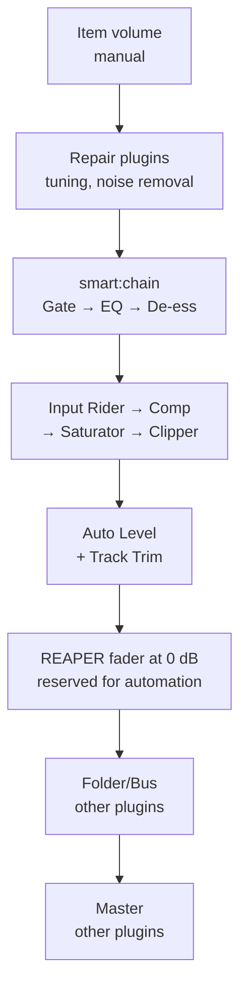

# Step by Step: The Best Gain Staging with sonible smart:chain in REAPER

Sep 20, 2026 · @Mark

> **In this plugin:** this document owns the workflow for sonible smart:chain. Target levels come from [gain-staging.md](gain-staging.md) and [compression.md](compression.md); where a figure here differs from those two, they win.
> Read it only when a track carries smart:chain. Learn, profile, Group, Layer, Auto Level and Re-Derive happen in the plugin's own interface: Claude measures and checks, the user clicks. Details in the last section, "Applying in this plugin".

The right order is: manual gain at the input → smart:chain learn → Group and Layer → Auto Level at the output → measure again with REAPER's meters. smart:chain does not replace input gain staging; it replaces the balancing and processing on each track.

## 1. Overview: which part of gain staging smart:chain takes on

smart:chain takes on the second half of gain staging on a track (processing and balance); the first half (the level going into the plugin) is still your manual job. sonible's own guide describes Auto Leveling as removing the repetitive gain staging at the start of a mix, not as replacing the engineer's final balance decisions ([source](https://digitalfilms.wordpress.com/2026/09/14/sonible-smartchain/)).

### Signal map in REAPER

Inside smart:chain, 7 modules run in a fixed order that cannot be changed: Gate → EQ → De-ess/De-harsh → Input Rider → Compressor → Saturator → Clipper ([source](https://digitalfilms.wordpress.com/2026/09/14/sonible-smartchain/)).

Any level change above the smart:chain box throws the learn result off; any change below it only changes the loudness.

### Who does what

| Gain staging task | Who | Tool | Reference target |
| --- | --- | --- | --- |
| Recording level | You | Preamp gain | Peak −12 to −6 dBFS |
| Level into smart:chain | You | Item volume, VSTi output | By source type (Step 1, section 3) |
| Level between modules | smart:chain | Learn, Re-Derive | Computed by the plugin |
| Slow level changes over the song | smart:chain | Input Rider | — |
| Balance between tracks | smart:chain + you | Auto Level, Track Trim | By ear |
| Group balance | smart:chain + you | Group Trim | Folder peak −10 to −6 dBFS |
| Overall headroom | You | Mix Trim, REAPER meters | Master peak ≤ −6 dBFS |
| Level into bus/master plugins | You | Group Trim, JS: Volume Adjustment | \~0 VU (≈ −18 dBFS RMS) |
| Final loudness | You | Other master plugins | Per platform |

**Note:** smart:chain launched on 26 August 2026 and is currently version 1.0 ([source](https://www.sonible.com/smartchain/)). Button names and behaviour may change in updates; some details in this document come from reviews and name their source.

## 2. Step 0 — Preparing REAPER and smart:chain

Do this once and save it in a template. The goal: every instance can see the others, recording has no added latency, and your meters are ready for checking.

1. **One format only.** On Windows use VST3. On Mac choose VST3 or AU and use it on every track; sonible has a FAQ about mixing AU and VST3 in one group (for smart:EQ 4), so don't mix them.
2. **Run native, not in a separate process.** For smart:EQ 4, sonible confirms that communication between instances relies on a shared process, so sandboxing stops it working ([source](https://help.sonible.com/hc/en-us/articles/11848540070300-Does-sandboxing-work-with-smart-EQ-4)). smart:chain very likely uses a similar mechanism. In REAPER, don't run smart:chain in a separate/dedicated process (bridge/firewall).
3. **Latency:** for mixing, leave it in Normal mode; REAPER compensates the delay automatically. According to users on Gearspace, Low latency mode has zero latency but turns off the Gate and De-ess/De-harsh ([source](https://gearspace.com/threads/sonible-announces-smart-chain-intelligent-channel-strip-plugin.1467819/)). When recording: bypass smart:chain or switch to Low latency.
4. **Name tracks before inserting the plugin.** Every track with smart:chain appears in the list on the left of the interface; clear names make grouping quick.
5. **Create a template FX chain "SC – Track"** containing smart:chain (not yet learned) → JS: Loudness Meter. Save it with FX menu → Save FX chain, and load it onto each track with Load FX chain.
   - Save the chain BEFORE learning. Copying a learned instance to another track carries over the analysis of the old track.
6. **Meters:** keep the setup from [gain-staging.md](gain-staging.md) (section 3): Master meter in LUFS-S, JS: VU Meter and JS: Loudness Meter ready.
7. **Test the load first.** One reviewer saw a Logic project grow from 54.5 MB to 1.18 GB with smart:chain on every track, and Logic crashed once in a 41-track mix ([source](https://digitalfilms.wordpress.com/2026/09/14/sonible-smartchain/)). Try it on a real session of your own, and save versions often.

**A REAPER trap to know:** a track's meter sits AFTER the FX chain. Once smart:chain is inserted, the track meter no longer tells you the level going into the plugin. To measure the input: bypass the track's FX, or temporarily put a JS: Loudness Meter in the first slot of the chain.

## 3. Phase A — Input gain staging (before learning)

smart:chain can only be as good as what it hears: the Gate, Compressor, Saturator and Clipper all react to level, and sonible says to learn while the source plays clearly at a suitable level ([source](https://help.sonible.com/hc/en-us/articles/29857225466908-What-does-Auto-Leveling-do-and-how-can-I-control-and-fine-tune-it)). So phase A must be completely finished before phase B.

**Step 1 — Bring items into the working range** (detailed figures in [gain-staging.md](gain-staging.md), section 5)

| Source type | Set by | Target (measured in the loudest section) |
| --- | --- | --- |
| Kick, snare, perc, pluck | Peak | −10 to −6 dBFS |
| Hi-hat, overheads, room | Peak | −18 to −8 dBFS |
| Bass, 808, synth bass | RMS | −20 to −14 dBFS |
| Distorted guitar, lead synth | RMS | −22 to −18 dBFS |
| Pad, strings | RMS | −26 to −20 dBFS |
| Vocal, sung / rap | LUFS-S | −22 to −16 |

- Multi-mic drums, overhead pairs: select every item and adjust by the same amount (or normalise with common gain).
- Virtual instruments: lower the output inside the instrument plugin.

**Step 2 — Even out big jumps by hand**

smart:chain's Input Rider handles slow level changes before the compressor ([source](https://bedroomproducersblog.com/2026/08/26/sonible-smartchain/)). Sudden jumps should still be fixed with item volume first:

- A single hit that is too loud, a shouted line far above the rest: split it (S) and lower it on its own.
- Takes recorded on different days at clearly different levels: bring them to the same level.
- Keep intentional differences between verse and chorus.

**Step 3 — Finish everything that sits before smart:chain**

- Tuning, noise removal, phase alignment and polarity for multi-mic drums, editing and take comping.
- These change the signal that smart:chain will analyse. Doing them after learning means learning again.

**Step 4 — Lock the REAPER side**

- Every track fader at 0 dB, pan set, pan law settled in Project Settings.
- Group the tracks into folders (Drums, Bass, Guitars, Keys, Vocals, FX). These folders will match smart:chain's Groups in phase C.
- Recheck the input by bypassing the track FX (the REAPER meter sits after FX).
- Save a "\_A\_input" version as a point to return to.

## 4. Phase B — Getting smart:chain into its best state

The "best state" means four things: the right profile, a learn on the right section, each module working just enough, and a comparison at the same loudness. Keep Auto Level OFF throughout this phase.

**Step 5 — Choose the source profile**

- Choose the closest type, for example Drums-Kick or Guitar-Electric; if unsure, leave it at Universal ([source](https://digitalfilms.wordpress.com/2026/09/14/sonible-smartchain/)).
- sonible stresses that each instance needs the right profile for Auto Level to be reliable ([source](https://help.sonible.com/hc/en-us/articles/29857225466908-What-does-Auto-Leveling-do-and-how-can-I-control-and-fine-tune-it)).

**Step 6 — Learn on the right section**

1. Make a time selection over a representative section and turn on Repeat (R).
2. The source must play clearly in that section; avoid sections with only silence, noise or bleed from other sources.
3. Press the green learn button and wait until the yellow exclamation mark next to the track name disappears ([source](https://digitalfilms.wordpress.com/2026/09/14/sonible-smartchain/)).
4. Sparse tracks (toms, FX, ad-libs): loop just the section where they play, then learn.
5. Tip: a Group lets you learn several instances from one window ([source](https://help.sonible.com/hc/en-us/articles/29856691562780-How-do-Groups-and-the-Front-Middle-and-Back-layers-work-and-which-modules-do-they-affect)). Use it only when the loop is representative for every track in the group.

**Step 7 — Inspect each module from a gain staging point of view**

| Module | Level-sensitive? | Look at | Signs of overdoing it |
| --- | --- | --- | --- |
| Gate | Yes | Opens and closes on the right notes | Cuts off note starts or tails |
| EQ | Slightly | Curve strength, Warm–Bright slider | Harsh, thin sound |
| De-ess / De-harsh | Yes | Switches to De-ess automatically on vocals | Lisping, lost "s" sounds |
| Input Rider | Yes | Evens out slow level changes over time | Verse and chorus equally loud, emotion lost |
| Compressor | Yes | GR per [gain-staging.md](gain-staging.md), section 5 (detail: [compression.md](compression.md), Part 4): vocal 3–6 dB, bass 3–6, kick/snare 2–6 | Transients lost, breaths louder |
| Saturator | Yes | Clean, Aggressive, Smooth modes | Harsh, breaking up |
| Clipper | Yes | Touches peaks only occasionally | Flattened kick/snare; a clipper working all the time = input too hot, go back to phase A |

All modules come from the same analysis; the two macro controls, Warm/Bright and Dynamic/Dense, steer the result quickly ([source](https://bedroomproducersblog.com/2026/08/26/sonible-smartchain/)). Adjust the macros first, individual modules after.

**Step 8 — A/B at the same loudness**

1. JS: Loudness Meter sits after smart:chain (already in the template FX chain).
2. Loop 4–8 bars and read LUFS-M with smart:chain on and with it bypassed.
3. If they differ by more than 0.5 LU: temporarily put JS: Volume Adjustment after smart:chain to compensate, and delete it once you have compared.
4. smart:chain has 8 state slots for comparing options within one instance ([source](https://bedroomproducersblog.com/2026/08/26/sonible-smartchain/)). Comparing slots must also happen at the same loudness.

**Step 9 — Lock in the state**

- The output of each smart:chain should not come close to 0 dBFS. If it does, review the makeup of the comp and saturator before moving on.
- The Master may be hot because Auto Level is not on yet — that is normal; phase D deals with it.
- Save presets for each source type (a preset can store the whole chain or single modules). A preset does not replace learning: a new track still has to be learned.
- Save a "\_B\_learned" version. **From here on, don't touch item volume or the plugins before smart:chain.**

## 5. Phase C — Group and Layer

Group and Layer are gain staging decisions in disguise: moving a track between layers changes the EQ, the compressor's attack/release and, with Auto Level on, the level relationships ([source](https://help.sonible.com/hc/en-us/articles/29856691562780-How-do-Groups-and-the-Front-Middle-and-Back-layers-work-and-which-modules-do-they-affect)). So settle the layers BEFORE turning Auto Level on.

**Step 10 — Create Groups that match the REAPER folders**

- Open the Group management page, create a group and drag tracks into it ([source](https://digitalfilms.wordpress.com/2026/09/14/sonible-smartchain/)).
- Each Group holds at most 10 instances ([source](https://help.sonible.com/hc/en-us/articles/29856691562780-How-do-Groups-and-the-Front-Middle-and-Back-layers-work-and-which-modules-do-they-affect)). Split a large kit into Drums 1 (kick, snare, toms) and Drums 2 (overheads, room, perc).
- Each Group should sit entirely within one REAPER folder. Then the Group Trim in phase D is also the control for the level going into the folder bus.
- A smart:chain Group is not an audio bus: it cannot process the group inside smart:chain, and with Auto Level on, the group's slider acts like a VCA ([source](https://digitalfilms.wordpress.com/2026/09/14/sonible-smartchain/)). The REAPER folder is still the real audio path to the bus plugins.

**Step 11 — Split into Front / Middle / Back**

A layer describes a track's depth and priority WITHIN its group. Front gets the strongest EQ emphasis ([source](https://digitalfilms.wordpress.com/2026/09/14/sonible-smartchain/)), so keep only 1–2 tracks per group in Front; putting everything in Front defeats the purpose.

| Group | Front | Middle | Back |
| --- | --- | --- | --- |
| Vocals | Lead vocal | Doubles, main harmonies | Distant harmonies, ad-libs, vocal pads |
| Drums 1 | Kick, snare | Toms | — |
| Drums 2 | — | Overheads, perc | Room |
| Guitars | Main riff / hook | Rhythm | Texture, ambient |
| Keys / Synth | Lead synth | Piano, keys | Pads, strings |
| FX | Impact | Riser | Ambience, foley |

The table is a suggestion for pop/rock/rap; a track's actual role in the song decides its layer.

**Step 12 — Listen again after splitting into layers (Auto Level still off)**

- Kick/snare placed in Middle or Back: listen to the transients again, because the comp's attack/release has changed.
- Any track that sounds thinner after moving to Front: lower the EQ strength of that track alone.
- Save a "\_C\_layers" version.

## 6. Phase D — Auto Level: output gain staging

Auto Level analyses the relationships between all learned instances to create a starting balance; you refine it with Genre Profile, Mix Trim, Group Trim and Track Trim, and these controls do not change the analysis underneath ([source](https://help.sonible.com/hc/en-us/articles/29857225466908-What-does-Auto-Leveling-do-and-how-can-I-control-and-fine-tune-it)). It handles the ratios between tracks; absolute headroom is still yours to measure.

**Step 13 — Check the conditions before turning it on**

- [ ] Every track learned, no yellow exclamation marks left
- [ ] The right profile on every instance
- [ ] Groups and layers settled
- [ ] REAPER faders at 0 dB

**Step 14 — Turn Auto Level on and choose a Genre Profile**

The choices include Pop, Blues, Rock and Rap ([source](https://digitalfilms.wordpress.com/2026/09/14/sonible-smartchain/)). Listen to the loudest section first, then a quiet one. If the balance sounds "wrong for the genre", change the genre before touching any trim.

**Step 15 — Refine from large to small**

| Control | Effect | Use when | Not for |
| --- | --- | --- | --- |
| Genre Profile | Changes the overall level relationships by style | The balance does not suit the genre | Fixing a single track |
| Group Trim | A whole group louder or quieter | The whole kit is quiet next to the vocal | Fixing a single track |
| Track Trim | One track above its computed level | One track is off by a constant amount through the song | Riding over time |
| Mix Trim | Changes the reference level of the whole mix | Bringing the Master headroom to target | Adjusting the balance |

Some reviews call Track Trim the Output trim ([source](https://bedroomproducersblog.com/2026/08/26/sonible-smartchain/)).

**Step 16 — Set the headroom with Mix Trim**

1. Loop the loudest section of the song and click to clear the peak-hold on the meters.
2. Look at the Master: the peak must be ≤ −6 dBFS. Look at each folder: peak −10 to −6 dBFS.
3. If over, lower Mix Trim; if too low (Master below about −12), raise it. The ratios between tracks stay the same.

**Step 17 — Divide the work between the trims and the REAPER faders**

- Fixed adjustments for the whole song → Track Trim, so every balance decision lives in one place, the smart:chain window.
- Rides over time → REAPER's Trim Volume envelope; faders stay around 0 dB.
- Exception: if a level-sensitive plugin (saturation, amp sim…) follows smart:chain on the same track, Track Trim changes that plugin's input level. Adjust the balance with the REAPER fader in that case.
- Save a "\_D\_autolevel" version.

## 7. Phase E — Measure again and hand over to the group/bus/master stages

smart:chain ends at each track's output; from the folders up it is the territory of other plugins, so a round of measurement is needed to hand over at the right level. Reviewers also note that smart:chain is strongest at track level, while the mix bus is usually still better served by dedicated plugins ([source](https://arefyevstudio.com/en/2026/08/26/sonible-smart-chain-review/)).

**Step 18 — The level into folder/bus plugins**

1. Put JS: VU Meter in the first slot of the folder's FX chain.
2. Analog-modelled plugins need the needle around 0 VU (≈ −18 dBFS RMS); folder peak −10 to −6 dBFS.
3. If off, fix it in this order: Group Trim (if the group matches the folder) → JS: Volume Adjustment in the folder's first slot. Neither breaks the ratios that Auto Level created.
4. Don't lower the folder fader to "rescue" the bus comp: the REAPER fader sits after FX.

**Step 19 — Reverb/delay sends**

Sends take the signal after smart:chain, so every change to Auto Level, Track Trim or Group Trim changes the amount sent. Listen to the dry/wet balance again after each big trim change; reverb returns stay 100% wet.

**Step 20 — The Master before the master chain**

- Peak −6 to −3 dBFS in the loudest section, no limiter yet.
- Render → Dry run to note the mix's LUFS-I and true peak.
- Listen again at a low volume and in mono: the balance from Auto Level must pass these two tests as well.

**Step 21 — Performance (optional)**

When a track is completely finished and the machine is struggling, you can Freeze the track in REAPER. A frozen track's smart:chain cannot be adjusted until you unfreeze it, so freeze only once the balance is settled.

**Step 22 — Save a "\_E\_handoff" version**, then move on to bus and master processing following [gain-staging.md](gain-staging.md) (section 4, stages 4–7).

## 8. Learn again, Re-Derive, or just trim?

Rule: a change BEFORE smart:chain → learn again; a big change INSIDE the first part of the chain → Re-Derive; a change AFTER it → just trim and measure again. Re-Derive updates the compressor after you have changed a lot earlier in the chain, without learning everything again ([source](https://bedroomproducersblog.com/2026/08/26/sonible-smartchain/)).

| You just changed | Do | Then check |
| --- | --- | --- |
| The item volume of a learned track | Learn that track again | Track Trim, folder peak |
| Comping, big edits, a new take | Learn again | Track Trim |
| Tuning, noise removal, plugins before smart:chain | Learn again | Track Trim |
| The source profile | Learn again | Auto Level for the whole group |
| Many Gate, EQ, De-ess adjustments inside smart:chain | Re-Derive | The compressor's GR |
| Moved a track to another layer | No need to learn | Transients, Group Trim, headroom |
| The Genre Profile | No need to learn | Master peak, Mix Trim |
| Added a new track | Load the template FX chain, learn, place it in a group and layer | The balance of the whole group, headroom |
| Want one track louder or quieter for the whole song | Track Trim | Folder peak |
| Want a whole group louder or quieter | Group Trim | VU at the bus input |
| The whole mix is too hot or too quiet | Mix Trim | Master peak |
| Riding over time | REAPER's Trim Volume envelope | The loudest section |

For very small item volume changes (under about 1 dB) you can try listening first; no sonible document says at what threshold a new learn is needed, so when in doubt, learn again.

## 9. Quick diagnosis when using smart:chain

Most errors fall into three groups: learning on the wrong material, changing levels after learning, or instances that cannot see each other.

| Symptom | Common cause | Fix |
| --- | --- | --- |
| The yellow exclamation mark is still next to the track name | Not learned, or the learn has not finished | Loop a representative section, learn again, wait for it to clear |
| Instances cannot see each other, tracks missing from the list | Mixed plugin formats, or running in a separate process | One format on every track; run native |
| Auto Level's balance sounds absurd | Wrong profile, or learned on silence, noise or bleed | Fix the profile, learn again on the right section |
| One track is suddenly way off after it was fine | Its item volume or an earlier plugin was changed | Learn that track again (section 8) |
| Kick/snare lose their punch | The clipper or comp works hard because the input is hot; or the track sits in the Back layer | Lower the item and learn again; reduce the clipper; move it to Front |
| The gate cuts off notes or tails | The input level changed after learning; or the source has wide dynamics | Learn again; adjust the gate threshold; turn the gate off if it is not needed |
| The vocal loses emotion, the verse is as loud as the chorus | Input Rider plus comp evening things out too much | Reduce the Input Rider, move Dynamic/Dense towards Dynamic |
| Turning smart:chain on sounds much better | Possibly just because it is louder | Loudness-matched A/B (Step 8) |
| The Master goes red after turning Auto Level on | The overall reference level is too high | Lower Mix Trim |
| The bus comp squashes too hard after Auto Level | The group feeds the folder too hot | Group Trim, or JS: Volume Adjustment in the folder's first slot |
| Much more or much less reverb after trimming | Sends take the signal after smart:chain | Readjust the sends |
| Cannot add a track to a group | The group already holds 10 instances | Split it into two groups |
| Latency while recording | Normal latency mode | Bypass while recording, or use Low latency (loses Gate, De-ess) |
| Heavy project, slow saves, high CPU | Analysis data and many instances | Save versions often; freeze finished tracks |

## 10. One-page checklist

Tick in order and don't skip phases. The target figures come from [gain-staging.md](gain-staging.md).

**Phase A — Input**

- [ ] Items in the working range per the Step 1 table, measured in the loudest section
- [ ] Sudden jumps evened out with item volume
- [ ] Tuning, noise removal, phase and comping done
- [ ] Faders at 0 dB, pan law settled, tracks in folders

**Phase B — smart:chain in its best state**

- [ ] The right profile on each track
- [ ] Learned on a representative section, no yellow exclamation marks
- [ ] Clipper touching only occasionally, comp GR in a sensible range
- [ ] Loudness-matched A/B, within 0.5 LU
- [ ] From here on, no more item volume changes

**Phase C — Group and Layer**

- [ ] Groups match folders, each group ≤ 10 instances
- [ ] Only 1–2 tracks per group in Front
- [ ] Transients rechecked after splitting into layers

**Phase D — Auto Level**

- [ ] Auto Level on, the right genre chosen
- [ ] Group Trim → Track Trim → Mix Trim
- [ ] Master peak ≤ −6 dBFS, folder peak −10 to −6 dBFS

**Phase E — Handover**

- [ ] Bus plugin input around 0 VU
- [ ] Reverb/delay sends listened to again
- [ ] Dry run: LUFS-I and true peak noted
- [ ] "\_E\_handoff" version saved

## Applying in this plugin

Claude measures, checks and adjusts the REAPER side; most smart:chain operations live in the plugin's interface, so the user clicks them. At a step that needs a click, name the step, wait for the user to confirm, then measure again.

| Step in this document | How to do it in the plugin |
| --- | --- |
| Find the tracks carrying smart:chain | `list_track_fx` per track, or one bridge command listing every track's FX. REAPER shows the name `VST3: smartChain (sonible)` |
| Phase A: measure the level going into smart:chain | Bypass smart:chain and every FX after it with `bypass_fx`, `render_stems`, measure each file, then turn them back on. How to measure: "Applying in this plugin" in [gain-staging.md](gain-staging.md) |
| Phase A: adjust item volume | Lua `D_VOL`, as in [gain-staging.md](gain-staging.md) |
| Learn, profile, Group, Layer, Auto Level, Genre, Re-Derive, latency mode | The user clicks them in the smart:chain interface |
| Track Trim, Group Trim, Mix Trim, macro controls | Read the parameter list with `get_fx_parameters` first. If the parameter exists, set it by its displayed value ([plugin-control.md](../../../reaper-mcp/references/plugin-control.md)); if not, it is an interface action |
| Step 8: loudness-matched A/B | `bypass_fx` on smart:chain, then compare by the level-matching rule in [audio-mixing.md](../audio-mixing.md), section 3 |
| Phases D and E: Master peak, headroom | `analyze_loudness`, `detect_clipping` |
| Phase E: folder peak, VU at the bus plugin input | Render the folder on its own and measure the file ([audio-measurement.md](../audio-measurement.md), "Choosing a measurement route") |
| Saving milestone versions (\_A\_input, \_B\_learned…) | `save_project` with a new path for each milestone |

A learned instance keeps the analysis of its original track: never copy a learned smart:chain to another track, whether with Lua or with a tool.

## Sources

- [sonible — smart:chain product page](https://www.sonible.com/smartchain/)
- [sonible — smart:chain User Guide](https://www.sonible.com/blog/smartchain-user-guide/)
- [sonible Help — Auto Leveling and the Trims](https://help.sonible.com/hc/en-us/articles/29857225466908-What-does-Auto-Leveling-do-and-how-can-I-control-and-fine-tune-it)
- [sonible Help — Groups and the Front/Middle/Back layers](https://help.sonible.com/hc/en-us/articles/29856691562780-How-do-Groups-and-the-Front-Middle-and-Back-layers-work-and-which-modules-do-they-affect)
- [sonible Help — Sandboxing with smart:EQ 4](https://help.sonible.com/hc/en-us/articles/11848540070300-Does-sandboxing-work-with-smart-EQ-4)
- [Oliver Peters (digitalfilms) — smart:chain review](https://digitalfilms.wordpress.com/2026/09/14/sonible-smartchain/)
- [Bedroom Producers Blog — smart:chain launch](https://bedroomproducersblog.com/2026/08/26/sonible-smartchain/)
- [Dubspot — smart:chain review (launch day)](https://blog.dubspot.com/sonible-smart-chain-2026)
- [Gearspace — user discussion on latency](https://gearspace.com/threads/sonible-announces-smart-chain-intelligent-channel-strip-plugin.1467819/)
- [Arefyev Studio — smart:chain review](https://arefyevstudio.com/en/2026/08/26/sonible-smart-chain-review/) (quoted from search results; the page blocks automated access)

The dBFS/LUFS targets are practical conventions from [gain-staging.md](gain-staging.md), not specifications published by sonible.
