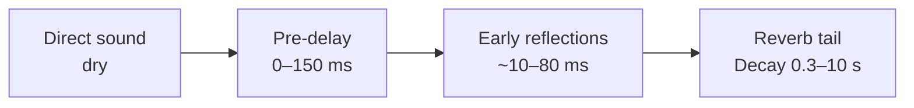

# Reverb in REAPER — Practical Tutorial & Cheat Sheet

Sep 20, 2026 · @Mark

> **In this plugin:** this document owns the reverb settings, the reverb bus set and reverb ducking. Other compressor settings follow [compression.md](compression.md); signal levels follow [gain-staging.md](gain-staging.md).
> Written for hands-on work in the REAPER interface. The last section, "Applying in this plugin", maps each step to the MCP tools and the Lua bridge.

## 1. Quick lookup: what you want to know → where to look

This document is a cheat sheet: find the question you have in the left column and jump to the right section. Every figure is a starting point; always adjust it by ear in the context of the whole song, not in solo.

| You want to… | Look at section | Where in the section |
| --- | --- | --- |
| Understand what a reverb control does (Pre-delay, Decay, Damping…) | 2. Parameters | The table "parameter → what the ear hears" |
| Choose Room, Plate, Hall, Spring or IR | 3. Reverb types & plugins | The table "type → who it suits" |
| Know what REAPER has built in, and what free plugins to add | 3. Reverb types & plugins | The plugin table |
| Create sends/returns, pre-EQ, save a template in REAPER | 4. Setup in REAPER | Steps 1–8 |
| Know whether to use reverb when recording, mixing, mastering | 5. By stage | The stage table + "When NOT to add reverb" |
| Place instruments front to back, build a standard bus set | 6. Depth | The three-row table + the 4-bus set |
| Settings for lead vocal, harmonies, rap, ballad | 7. Vocals | The vocal table + the 5-step workflow |
| Settings for kick, snare, overheads, percussion | 8. Drums & percussion | The drum table |
| Bass, guitar, piano, pads, synths, horns | 9. Bass, guitar, keys, synths | The instrument table |
| Strings, orchestra, SFX, dialogue, by genre | 10. Orchestra, SFX, genres | Three separate tables |
| Work out pre-delay and decay from the BPM | 11. Techniques that don't break things | Formula + BPM table |
| Keep reverb from muddying the mix or covering the lyrics | 11. Techniques that don't break things | EQ on returns, ducking, de-ess |
| Make reverb throws, reverse reverb, a gated snare | 12. Creative techniques | Step by step in REAPER |
| The mix is muddy, harsh, smeared or distant — how to fix it | 13. Troubleshooting | The symptom table |
| A last check before export | 14. Checklist | Tick list |

Conventions: Decay in seconds (RT60, the time for the tail to fall by 60 dB). Pre-delay in ms. HPF is a low-cut filter, LPF a high-cut filter. A "return" is the track holding a reverb that receives sends from other tracks.

## 2. Foundations: what each parameter does

A reverb has three parts in time: the direct sound, the early reflections and the late tail. The ear uses the early reflections to judge room size and distance, while the tail decides how "wet" it sounds.



Read it from left to right: the direct sound reaches the ear first, then comes the gap, then the discrete reflections, then the tail that thickens and dies away.

| Parameter | What it does | What the ear hears | Common range | Overdone |
| --- | --- | --- | --- | --- |
| Pre-delay | The delay between the direct sound and the moment the reverb starts | Long: the direct sound separates from the reverb, clearer and closer | 0–150 ms | Too long becomes a separate echo; too short smears the direct sound and pushes it back |
| Decay (RT60, Reverb time) | How long the tail takes to die | Long: a large, wet space | 0.3–4 s, FX up to 10 s+ | Smeared, piling up, filling the gaps |
| Size (Room size) | The size of the virtual room, the spacing between reflections | Large: sparse, wide reflections | Goes with the decay | A small size + long decay sounds "metallic", fake |
| Early reflections (ER level) | The level of the early reflections | More: a real-room feel, the source moves back | Depends on the goal | Phasing, smeared transients |
| Diffusion / Density | How scattered and dense the reflections are | High: smooth and continuous; low: individual echoes audible | High for vocals, pads; medium for drums | Low on vocals sounds "pattering", flutter |
| HF Damping | Highs die faster than lows | More: warm, dark, a room with curtains | Cutoff 3–8 kHz | Too much is muddy; too little is harsh, hissy |
| Low cut / High cut | Filters the wet part | HPF removes mud, LPF removes harshness | HPF 150–600 Hz, LPF 5–12 kHz | HPF too high: a thin reverb, like a radio |
| Bass multiplier (Low decay) | A separate decay for the lows | Above 1: the lows ring longer | 0.6–1.0x when mixing | Above 1 easily turns to mud |
| Width | The stereo width of the wet part | Wide: surrounds the listener | 60–100% | Lost in mono, a hole in the middle |
| Modulation | Gently wobbles the delay times in the tail | Smoother, less metallic ringing | Low for piano, guitar | Instruments with a clear pitch sound out of tune |
| Mix (Wet/Dry) | The wet/dry ratio | — | Insert: 5–30% wet. Return: 100% wet | Dry left on a return: the direct sound doubles, phase problems |
| Freeze / Infinite | Holds the tail forever | Becomes a pad | Only for FX | — |

Real spaces as a reference for the ear (approximate figures):

| Space | Decay |
| --- | --- |
| A bedroom, a small treated studio room | 0.2–0.5 s |
| A studio live room | 0.5–1.0 s |
| A concert hall | 1.8–2.2 s |
| A large cathedral, a cave | 3–8 s or more |

The decay on a plugin is the time to fall by 60 dB. In a dense mix, the part of the tail you actually hear is often only about half that figure.

## 3. Reverb types and plugins in REAPER

Choose the reverb type by purpose first, then set the numbers. Plate for vocals, Room for drums and "glue", Hall for depth: that trio covers most songs.

| Type | Character | Suits | Avoid for |
| --- | --- | --- | --- |
| Room | A small room, 0.2–1.0 s, many early reflections | Drums, guitars, rap, rock, gluing the whole mix | Pads, strings that need vastness |
| Ambience | Almost only early reflections, a very short tail | Adding "air" without an audible tail: dialogue, drum bus, bass | When you need a clear tail |
| Chamber | An artificial echo chamber like in old studios, 0.8–2 s, warm, natural | Vocals, strings, a 60s–70s sound | Electronic music that needs to stay clean |
| Hall | A concert hall, 1.5–3.5 s, a smooth tail | Strings, piano, ballads, pads, orchestra | Fast, dense music; fast rock drums |
| Plate | A metal plate, dense from the start, bright, no obvious "room" | Pop vocals, snare, sax, horns | Acoustic instruments that need a real room |
| Spring | The spring in a guitar amp, a "boing" sound, lo-fi | Clean guitar, surf, dub, lo-fi | Modern vocals (except as an effect) |
| Convolution (IR) | A capture of a real space or device | Matching a room for dialogue/SFX, orchestra, churches | Monitoring while recording (latency), when you need flexible adjustment |
| Gated | A dense tail cut off abruptly | 80s snares and toms, synthwave | Gentle ballads |
| Shimmer | The tail is pitched up an octave | Ambient, post-rock, pads | Dense mixes |
| Reverse | A reversed tail that "sucks" into the sound | Transitions, vocal intros | Regular use |

**Plugins: built in, and worth installing**

| Plugin | Type | Price | Use when |
| --- | --- | --- | --- |
| ReaVerbate (built in) | Simple algorithmic: Wet, Dry, Room size, Dampening, Stereo width, Initial delay (pre-delay), Lowpass, Hipass | Free | Headphone reverb while recording (no latency), a simple room, sketching |
| ReaVerb (built in) | Convolution: load an IR .wav file, or create your own IR with the Reverb generator / Echo generator, with filters in the chain | Free | Real spaces, churches, room matching |
| Dragonfly Reverb | A set of 4 plugins: Hall, Room, Plate, Early Reflections | Free, open source | Building the standard bus set in section 6; install it first |
| Valhalla Supermassive | Huge delays/reverbs, lots of modulation | Free | Pads, FX, throws, close to shimmer |
| TAL-Reverb-4 | A vintage-style plate, with modulation | Free | Vocals, synths, lo-fi |
| Valhalla VintageVerb, Valhalla Room, FabFilter Pro-R | High-quality algorithmic | Paid | Once you are comfortable and want to upgrade |

Free IR sources for ReaVerb: the OpenAIR library (University of York), EchoThief, and Voxengo's free IR set. Load them with the Add → File button in ReaVerb.

A tip in REAPER: every FX window has its own Wet knob in the top right corner. When you insert a reverb directly on a track, this knob can set the wet/dry mix for any plugin.

## 4. Setup in REAPER: a standard send/return

Put the reverb on a track of its own (a return) and send many tracks to it. A shared space helps the mix hold together, saves CPU, and one adjustment covers the whole group.

|  | Send/Return (the default to use) | Insert directly on the track |
| --- | --- | --- |
| When | A shared space for many sources | The reverb is part of that one track's sound (a guitar's spring, a short room for one loop) |
| Mix | 100% wet, dry off | 5–30% wet, with the plugin's knob or the FX window's Wet knob |
| Pros | EQ, ducking and automation just for the wet part | Quick, fewer tracks |
| Cons | One more track | Hard to process the wet part separately |

**Creating a reverb bus, step by step**

1. Create a new track (Ctrl+T) with a clear name such as "RV Plate Vox". Give every return the same colour.
2. Click the FX button and add, in this order: ReaEQ (pre-EQ) → reverb → ReaComp (if ducking is needed, section 11).
3. In ReaEQ: one High Pass band at 200–500 Hz, one Low Pass band at 8–10 kHz.
4. In the reverb: Wet 100%, Dry off. With ReaVerbate, pull Dry down to -inf.
5. Create the send: drag the source track's ROUTE (I/O) button onto the reverb track. Or open the source track's Routing window → Add new send → choose the reverb track.
6. Choose the send type in the Routing window (see the table below). Start the send level at -15 to -20 dB.
7. Gather the returns into an "FX Returns" folder at the end of the project.
8. Save it so you never have to redo it: select the returns → Track menu → Save tracks as track template. Or save the whole project as a template in File → Project templates.

| REAPER send type | The reverb receives the signal | Use when |
| --- | --- | --- |
| Post-Fader (Post-Pan) | After FX and fader | Default: move the fader and the reverb follows; the wet/dry ratio stays the same |
| Pre-Fader (Post-FX) | After FX, before the fader | You want to fade the direct sound and leave the tail behind (a "walking away" effect), throws |
| Pre-FX | Before all of the track's FX | Rare: you want the reverb to receive the raw signal, uncompressed and undistorted |

The default send type can be changed in Options → Preferences → Project → Track/Send Defaults. Each send also has its own Pan knob, used for the spatial balancing tip in section 11.

**Places where REAPER loses or ruins reverb**

- Input FX (the IN FX / Rec FX button): FX placed here are recorded straight into the file. Never put a reverb here.
- Take FX (FX on an item): the tail is cut off at the end of the item. Move it to track FX, or turn off Loop source (F2) and extend the item.
- Render: extend the render range 3–5 seconds past the last note. When rendering a time selection or region, tick Tail and set it longer than the longest decay.
- Checking mono: open Actions (the ? key), search "mono" to find the action that toggles mono on the master, then assign it a shortcut.

## 5. When to use reverb: stage by stage

Reverb belongs mainly to mixing. While recording it is only for listening, while mastering it is almost never used, and in production it is used like an instrument.

| Stage | Use it? | Purpose | How in REAPER | Notes |
| --- | --- | --- | --- | --- |
| Recording (tracking) | Yes, for listening only | The singer sings comfortably and holds pitch better | ReaVerbate in track FX (not Input FX). Record mode "Record: input" records the dry signal | Don't record the reverb into the file. Avoid convolution because of its latency |
| Songwriting, arranging | Yes, as part of the sound | Pads, shimmer, reverse swells, atmosphere | Print it to audio with "Apply track/take FX to items as new take", or by rendering a stem | Keep the dry version and note the settings |
| Mixing | The main place | Depth, a shared space, cohesion | The send/return bus set (sections 4 and 6) | Add it after the levels, EQ and compression of the dry part |
| Mastering | Hardly ever | Only a very light "glue" | Room/ambience 0.3–0.6 s, wet 2–5% | Spatial problems should be fixed in the mix |
| Film and game post-production | Yes, to match the scene | ADR matching the shooting location, SFX in the right environment | ReaVerb with an IR of the matching room | Outdoors has almost no tail |
| Podcast, voice-over, audiobooks | Almost never | Intelligibility | At most a very small ambience | Treat the room acoustics instead of adding reverb |

**Order within the mix**

1. Level, EQ and compress the dry part of each track.
2. Build 2–4 reverb buses (section 6).
3. Send from the back row first (pads, harmonies), then from the front row (lead vocal).
4. EQ and ducking on the returns.
5. Automate the sends section by section.
6. Listen to the whole song again at a low volume, and check mono.

**When NOT to add reverb**

- The source already has space: room mics, sample libraries with distant mics, loops with reverb on them, synth presets with built-in reverb.
- The low end: kick, bass, 808, sub. Lows in a reverb are the number-one cause of mud.
- Dense and fast music, fast rap, metal riffs: the tail fills in the rhythm.
- Dialogue that must be clear word by word.
- When what you really want is for the track to be "louder" or "better": that is the job of the fader, EQ and compression.

## 6. Three layers of depth and the standard reverb bus set

Think of the mix as a stage with three rows: front, middle and back. Reverb, together with level and brightness, is the main tool for placing who stands in which row.

The distance rule: close is loud, bright, a long pre-delay and little reverb. Far is quiet, dark, a short pre-delay, lots of early reflections and lots of reverb.

| Row | Who stands here | Dry level | Pre-delay | Amount of reverb | Brightness |
| --- | --- | --- | --- | --- | --- |
| Front | Lead vocal, kick, snare, bass, solo instruments | Loud | 60–150 ms | Little, short | Bright, transients kept |
| Middle | Guitars, piano, keys, harmonies | Medium | 20–60 ms | Medium, plate or room | Medium |
| Back | Pads, background strings, choir, auxiliary percussion | Quiet | 0–20 ms | Lots, hall | Dark: LPF 5–8 kHz, high damping |

**A set of 4 buses that works for most songs**

| Bus | Type | Decay | Pre-delay | Pre-EQ on the return | Use for |
| --- | --- | --- | --- | --- | --- |
| A – RV Room | Room or Ambience | 0.3–0.8 s | 0–10 ms | HPF 150–250 Hz, LPF 10–12 kHz | Drums, guitars, percussion; shared "glue" for the whole mix |
| B – RV Plate | Plate | 1.2–2.0 s | 40–100 ms (or a 1/32–1/16 note) | HPF 250–500 Hz, LPF 8–10 kHz | Lead vocal, snare, sax, lead synth |
| C – RV Hall | Hall | 2.0–3.5 s | 10–40 ms | HPF 200–300 Hz, LPF 6–8 kHz | Strings, pads, piano, harmonies, ballads |
| D – RV FX | Spring, shimmer, gated, Supermassive | Varies | Varies | Varies | Throws, transitions, effects |

A delay bus (1/8 or 1/4 note) for the vocal is usually added as well. A delay gives a sense of width while keeping the lyrics clearer than more reverb would.

The whole song should have 2–4 spaces. More than that usually puts every instrument in a different place and sounds disjointed, unless you mean it.

## 7. Cheat sheet: vocals

The safe formula for a lead vocal: plate + a long pre-delay + a high HPF on the return + de-essing before the reverb + ducking, plus a delay. The vocal is where reverb breaks things most easily: too much and it turns into "karaoke" and the lyrics get lost.

| Vocal type | Reverb | Decay | Pre-delay | Return HPF / LPF | Add | Notes |
| --- | --- | --- | --- | --- | --- | --- |
| Pop lead | Plate | 1.2–2.0 s | 60–120 ms | 300–500 Hz / 8–10 kHz | 1/8 or 1/4 delay; ducking 3–6 dB | Just enough that the vocal sounds "bare" when you turn it off |
| Ballad, bolero, Vietnamese romantic ballads | Hall or a long plate | 2.0–3.0 s | 80–150 ms | 300 Hz / 7–9 kHz | 1/4 delay, low feedback | Wetter than Western pop; keep the lyrics clear with pre-delay and ducking |
| Rock | A short plate or room | 0.8–1.5 s | 30–80 ms | 300 Hz / 8 kHz | Slapback 80–140 ms | A slapback can replace most of the reverb |
| Rap, hip-hop | A short room/ambience, or none | 0.3–0.8 s | 10–30 ms | 400–600 Hz / 7 kHz | Throws at the ends of lines | Fast rap is almost dry |
| R&B, soul | A smooth plate or hall | 1.5–2.5 s | 40–100 ms | 300 Hz / 9 kHz | 1/4 delay | Medium modulation for a soft tail |
| Harmonies, backing vocals | Hall, or the lead's plate with more send | 1.5–3.0 s | 0–30 ms | 300 Hz / 6–8 kHz | Wide width | They stand behind the lead: wetter and darker |
| Choir | Hall or church | 2.5–4.0 s | 10–30 ms | 200 Hz / 8 kHz | — | Check whether the recording already has a room in it |
| Ad-libs, whispers | A long hall, FX | 2–5 s | 0–50 ms | 400 Hz / 7 kHz | Throws, reverse | Place them far away, to the sides |
| Speech, podcast | None, or ambience | 0.2–0.4 s | 0–10 ms | 200 Hz / 8 kHz | — | Very little wet, only to take the edge off the "dryness" |

**Lead vocal workflow in REAPER**

1. FX chain on the vocal track: EQ → compression → de-esser. Search "de-ess" in the FX browser, or use ReaXcomp with one band at 5–9 kHz.
2. A Post-Fader send to "RV Plate Vox", starting at -18 dB. Add a send to the delay bus.
3. On the return: ReaEQ (HPF 300–500 Hz, LPF 8–10 kHz) → plate 1.5 s, pre-delay 80 ms → ReaComp ducking to the vocal (section 11).
4. Solo the vocal together with the return to shape the character of the reverb. Unsolo, then set the send level while listening to the whole song.
5. Automate the send: less in the verse, 2–4 dB more in the chorus, throws on the last word of lines (section 12).

**Common signs of getting it wrong on vocals**

- "S" sounds dragging a hissy tail: de-ess before the send, LPF the return down to 7–8 kHz.
- The lyrics are covered: raise the pre-delay, turn on ducking, lower the send by 2–3 dB.
- The vocal sounds distant and small: too much send, or too short a pre-delay.
- The gaps sound abruptly dry: use throws instead of more reverb over the whole song.

## 8. Cheat sheet: drums and percussion

With drums, reverb must keep the punch: a short tail, no lows let in, and it must die before the next hit. Kick and 808 are almost always dry; the snare is where reverb creates character.

| Source | Reverb | Decay | Pre-delay | Return HPF / LPF | Notes |
| --- | --- | --- | --- | --- | --- |
| Kick | None, or a very short room | 0.2–0.5 s | 0 ms | HPF 150–250 Hz | Only gives the click some "room"; EDM, trap: none |
| Pop, rock snare | Plate or room | 0.8–1.8 s | 0–20 ms | 200–300 Hz / 8–10 kHz | The tail dies before the next snare hit (see the example below) |
| 80s snare | Gated | Gate open 0.3–0.6 s | 0 ms | 200 Hz / 10 kHz | Method in section 12 |
| Toms | A bus shared with the snare, or a room | 0.6–1.5 s | 0–10 ms | 100–150 Hz / 8 kHz | Big fills: raise the send with automation |
| Overheads, cymbals | Little or none | A short room | 0 ms | 300 Hz / 6–8 kHz | Cymbals through a reverb easily get harsh and hissy |
| Room mic | Don't add any | — | — | — | It is already real reverb; compress the room mic for more sense of room |
| The whole kit (drum bus) | Room or ambience | 0.3–0.8 s | 0–10 ms | 150–200 Hz / 10 kHz | Puts every piece of the kit "in the same room" |
| Clap, electronic snare | Plate, room or a short hall | 0.5–1.5 s | 0–20 ms | 300 Hz / 9 kHz | Keep electronic hi-hats dry |
| 808, sub | None | — | — | — | Avoid entirely |
| Shaker, tambourine, conga, cajon | Room or hall, more than the main drums | 0.8–1.5 s | 0–20 ms | 300 Hz / 8 kHz | Pushes them to the back row, makes them wide |
| Timpani, cinematic drums | A large hall | 2–4 s | 10–30 ms | 60–80 Hz / 8 kHz | More low-end reverb is allowed because the music is sparse |

An example decay calculation for a snare: at 120 BPM, a snare on beats 2 and 4 hits once every 1 second. A decay of about 0.8–1 s works well; longer, and the tail runs into the next hit.

**Keeping the drums' punch**

- A pre-delay of 10–20 ms so the transient gets through before the reverb starts.
- Prefer early reflections (room, ambience) over a long tail.
- Tempos above 150 BPM, or metal: a room under 0.6 s, or none.
- A wide stereo reverb on the snare while the dry snare sits in the centre: creates size without blurring the centre.

## 9. Cheat sheet: bass, guitar, keys, synths, horns

The more low end and the faster the part, the less reverb; the sparser and more sustained, the more it can take. Before adding any, turn off the reverb built into synth presets or samples so you control it at the bus.

| Source | Reverb | Decay | Pre-delay | Return HPF / LPF | Notes |
| --- | --- | --- | --- | --- | --- |
| Electric bass, synth bass | None by default | — | — | If needed: HPF 400–700 Hz | Only to give the pluck and string noise some space |
| Jazz double bass | Room/ambience | 0.5–1.0 s | 0–10 ms | 250 Hz / 8 kHz | Like a real performance room |
| Acoustic guitar, strummed accompaniment | Room or chamber | 0.8–1.5 s | 10–30 ms | 200–300 Hz / 8–10 kHz | Many early reflections, little tail |
| Acoustic solo, fingerstyle | Hall or chamber | 1.5–2.5 s | 20–40 ms | 200 Hz / 9 kHz | Low modulation |
| Clean electric | Spring or plate | 1.0–2.0 s | 0–20 ms | 250 Hz / 7 kHz | Many amp sims have a spring built in; an insert works too |
| Distorted electric (rhythm) | A short room or none | 0.3–0.6 s | 0–10 ms | 300 Hz / 6 kHz | Reverb blurs the riff; double-tracking is already wide enough |
| Lead guitar, solo | Plate or hall + delay | 1.5–2.5 s | 50–100 ms | 300 Hz / 7–8 kHz | Ducked by the guitar itself |
| Ambient, post-rock guitar | Shimmer, a long hall | 4–10 s | 0–50 ms | 200 Hz / varies | Print it to audio once you like it |
| Classical solo piano | Hall, or a concert hall IR | 1.8–2.5 s | 20–40 ms | 80–100 Hz / 10 kHz | Low modulation so it doesn't go out of tune |
| Piano in a pop band | Plate or room | 1.0–1.5 s | 20–40 ms | 250–300 Hz / 8 kHz | The piano's left hand often fights the bass in the lows |
| Rhodes, EP | Plate, chamber or spring | 1–2 s | 20–40 ms | 250 Hz / 7 kHz | Spring for a vintage colour |
| Organ | Room or hall | 1–2 s | 10–30 ms | 200 Hz / 7 kHz | A Leslie already has movement; moderate reverb |
| Pad | Hall, or none | 2–6 s | 0–20 ms | 300 Hz / 6 kHz | Pads are usually already dense and easily cause mud |
| Synth lead | Plate or hall + delay | 1–2.5 s | 30–80 ms | 300 Hz / 8 kHz | Ducked by the lead itself |
| Pluck, arp | A tempo-matched hall | 1.5–3 s | 0–30 ms | 300 Hz / 8 kHz | Ducked to the kick so it doesn't smear |
| Sax, trumpet, horn solos | Plate or hall | 1.2–2 s | 30–60 ms | 250 Hz / 8 kHz | A plate is the classic choice for sax |

A tip for doubled guitars (hard-panned L/R): send both to the same short room at a low level. The two sides "stick" together while the riff stays tight.

## 10. Cheat sheet: orchestra, SFX, dialogue, by genre

With orchestras and film sound, reverb simulates a real space. The standard method: separate early reflections to set the seating, and a shared tail so that everything sits in the same room.

**Orchestra: separate ER + a shared tail**

1. Each section (strings, brass, woodwinds, percussion) gets its own Dragonfly Early Reflections track to set its distance.
2. All of them send to one single Hall bus for the tail.
3. Sample libraries with close/room/ambient mics: prefer the library's room mics and add less reverb.

| Section | Reverb | Decay | Pre-delay | Notes |
| --- | --- | --- | --- | --- |
| Strings | Hall | 2–3 s | 10–30 ms | Return HPF 100–150 Hz |
| Woodwinds | Hall or chamber | 2–2.5 s | 10–20 ms | Seated in the middle, behind the strings |
| Brass | Hall, more send | 2–3 s | 0–20 ms | Seated at the back: LPF 6–7 kHz to darken it |
| Percussion | Hall | 2.5–4 s | 0–10 ms | Furthest away, wettest |
| Choir | Hall or church | 3–5 s | 10–30 ms | A church IR in ReaVerb suits it well |

**SFX, film, games: matching the environment**

| Environment | Method | Decay |
| --- | --- | --- |
| A small indoor room | Room, many early reflections | 0.3–0.6 s |
| A car, a cupboard, a small closed space | Early reflections only, a "boxy" feel | Under 0.2 s |
| Corridors, stairwells, car parks | A real IR in ReaVerb (EchoThief has many) | 1–3 s |
| Churches, caves | A large hall or an IR | 3–8 s or more |
| Outdoors | Almost no tail; only discrete echoes from walls or mountains (delay 100–500 ms, dark) | Don't use reverb |
| Telephone, radio | Not reverb: use a narrow-band EQ, 300 Hz–3 kHz | — |

The further away the object: lower the dry level, raise the wet ratio, cut more highs. ADR dialogue needs an IR of the same kind of room as the shooting location to match the production sound.

**By genre**

| Genre | Total amount of reverb | Main type | Character |
| --- | --- | --- | --- |
| Modern pop | Medium, the vocal fairly close | Plate + delay | Long pre-delay, ducking |
| Ballad, Vietnamese bolero | A lot | A long hall/plate + delay | A wet vocal that must still keep its lyrics clear |
| Rock | Medium | Room for the drums, plate for the vocal | Drums in a big room |
| Metal | Little | A short room | Riffs and double kick must stay clear |
| EDM | A lot, but ducked | Tempo-matched hall/plate, gated | Sidechained to the kick |
| Hip-hop, trap | Little | A short room, throws | A dry 808 and kick |
| Lo-fi | Medium, dark | Spring, chamber, a dark plate | LPF 4–6 kHz, modulation |
| Jazz | Natural, little | Room or a small hall | Like a real performance room |
| Classical | Natural | Hall or IR | 1.8–2.5 s |
| Ambient, post-rock | A great deal | Shimmer, a long hall | Reverb is an instrument |
| Synthwave, 80s | A lot | Gated snare, plate/hall | Bright, wide tails |

## 11. Techniques for applying reverb without breaking things

The six techniques below keep the core of each source: clarity, punch, a clean low end and the rhythm. Apply them in order: EQ on the return first, then the pre-delay, and only then ducking.

**11.1 EQ on the return**

- HPF 150–600 Hz: takes the lows out of the reverb, the most common source of mud.
- LPF 6–10 kHz: takes out harshness and hiss, and pushes the reverb further back.
- A classic tip from Abbey Road: an HPF around 600 Hz and an LPF around 10 kHz before the reverb. The reverb stays clear, without mud.
- Still "boxy": cut another 2–4 dB at 200–500 Hz. Reverb covering the lyrics: a gentle cut at 2–4 kHz on the return.
- EQ before the reverb decides what excites the reverb. EQ after the reverb fixes the result. You can use both.

**11.2 Tempo-matched pre-delay and decay**

Pre-delay separates the direct sound from the reverb, which keeps the clarity. Matching it to the BPM makes the reverb "breathe" with the beat instead of clashing with it.

```latex
T_{1/4}\ (\text{ms}) = \frac{60000}{\text{BPM}}
```

Halve it repeatedly for 1/8, 1/16, 1/32 and 1/64. Pre-delays usually use a 1/64 to a 1/16 note. The tail (pre-delay + decay) should finish within 1/2 to 1 bar for vocals, and within 1 beat to 1/2 bar for the snare.

| BPM | 1/4 (ms) | 1/8 (ms) | 1/16 (ms) | 1/32 (ms) | 1/64 (ms) |
| --- | --- | --- | --- | --- | --- |
| 70 | 857 | 429 | 214 | 107 | 54 |
| 80 | 750 | 375 | 188 | 94 | 47 |
| 90 | 667 | 333 | 167 | 83 | 42 |
| 100 | 600 | 300 | 150 | 75 | 38 |
| 110 | 545 | 273 | 136 | 68 | 34 |
| 120 | 500 | 250 | 125 | 63 | 31 |
| 128 | 469 | 234 | 117 | 59 | 29 |
| 140 | 429 | 214 | 107 | 54 | 27 |
| 150 | 400 | 200 | 100 | 50 | 25 |
| 170 | 353 | 176 | 88 | 44 | 22 |

Example at 120 BPM, pop vocal: pre-delay 1/32 = 63 ms, decay about 1.5–1.9 s so that the tail ends around 1 bar (2 s).

**11.3 Ducking: the reverb gets quieter while the source plays**

The reverb gets quieter while the singer sings and blooms in the gaps. You get both clarity and wetness. In REAPER:

1. On the reverb track: ROUTE button → Track channels → choose 4.
2. On the vocal track: keep the existing send into channels 1/2. Add a second send to the same reverb track and change its Audio destination to 3/4.
3. Put ReaComp AFTER the reverb on the return track. Set Detector input to Auxiliary Input L+R.
4. Ratio 2:1–4:1, Attack 5–20 ms, Release 150–400 ms. Lower the Threshold until it reduces 3–6 dB while the singer is singing. Detailed sidechain routing: [compression.md](compression.md), Part 6.

EDM: do exactly the same, but key it from the kick. The reverb of pads and plucks will "pump" with the beat and won't smother the kick.

**11.4 De-ess before the reverb**

A bright plate amplifies "s", "x" and "ch" into long hissy tails. Put a de-esser on the vocal track; a Post-Fader send takes the de-essed signal. For a heavier hand, add another de-esser on the return, before the reverb.

**11.5 Width, mono and send pan**

- A vocal in a dense mix: reduce the reverb width to 60–80% so the reverb hugs the vocal.
- Always check mono: a reverb that is too wide can disappear, or sound odd on phone speakers.
- A spatial balancing tip: with a guitar panned 60% left, turn its send's Pan knob 30–40% to the right. The reverb fills the empty space on the other side.

**11.6 Setting the right level and checking it**

- Raise the send until the reverb is clearly audible, then back off 2–3 dB.
- The mute test: mute the return and something is missing; unmute it and you don't consciously notice the reverb. That is the right level for most songs.
- Listen at a low volume: excess reverb shows up immediately.
- Compare with a reference track of the same genre, level-matched before comparing.
- Headphones make reverb more audible than speakers. Check on both.
- Avoid stacking reverbs: samples, loops and synth presets that already have reverb should have it turned off or down before you send more.

## 12. Creative techniques in REAPER

These five techniques give clear effects without making the whole song wet. What they share: the reverb appears only exactly where you want it.

**12.1 Reverb throw: a long reverb on one word**

Method A, with automation:

1. Click the envelope button on the vocal track and enable the "Send volume" envelope of the send to the Hall bus or the delay.
2. Draw the envelope up 6–10 dB exactly on the last word of the line, and back down right after it.

Method B, tidier and easier to edit:

1. Create a "VOX Throw" track. In its Routing, untick Master/Parent send.
2. Create a 0 dB send from this track to a 3–4 s Hall bus or a 1/4 delay.
3. Split (S key) the word that needs the reverb out of the original vocal item, and Ctrl+drag a copy onto the Throw track.

This gives a long tail while the dry sound stays exactly where it was on the original track. To throw another spot, just copy another item.

**12.2 Reverse reverb: a reverb that "sucks" into the word**

1. Ctrl+drag the word or line that needs a swell onto a new "Rev Swell" track.
2. Right-click the item → Item processing → Reverse items as new take.
3. Press F2 (Item properties) and untick Loop source. Drag the item's right edge 3–4 s longer to leave room for the tail.
4. Put a 2–4 s hall or plate on this track, 100% wet, dry off.
5. Run "Apply track/take FX to items as new take" (find it in the item's right-click menu or in Actions).
6. Bypass the reverb on the track. Reverse the new take once more.
7. Position the item so the peak of the swell lands exactly where the original word starts. Cut away the part after the peak, and add a long fade-in at the start.

**12.3 Gated reverb for an 80s-style snare**

1. Create an "RV Gated" bus with Track channels = 4.
2. The snare sends one send into channels 1/2 (to excite the reverb) and one into 3/4 (as the key).
3. FX on the bus: a dense reverb (plate/hall, decay 2–3 s, pre-delay 0, high diffusion) → ReaGate.
4. ReaGate: Detector input set to Auxiliary. Attack 0–1 ms, Hold 200–400 ms (or about a 1/8 note), Release 20–80 ms.
5. Lower the Threshold until only the snare hits open the gate. For a flatter, denser tail, put a hard-driven compressor between the reverb and the gate.

**12.4 Shimmer, pads from reverb, and delay into reverb**

- Quick shimmer: Valhalla Supermassive has modes for bright, huge tails built in.
- A simple home-made shimmer: ReaPitch +12 semitones before a long hall, blended low with a normal hall.
- Delay into reverb: send the return of a 1/4 delay into the Hall bus. The repeats dissolve gradually into the reverb, which suits ballads and ambient very well.

**12.5 Automation that follows the song structure**

- Verses drier, choruses 2–4 dB wetter; a bridge can be very wet for contrast.
- Before a drop: raise the reverb, then cut it dead (mute the return) exactly on the first beat of the drop.
- Outro: raise the send on the last note and let the tail die on its own. Remember to render extra tail (section 4).

## 13. Troubleshooting: symptom → cause → fix

Most reverb mistakes come from three things: lows in the reverb, tails longer than the rhythm allows, and levels that are too high. Find the symptom you hear in the first column.

| Symptom | Common cause | Fix |
| --- | --- | --- |
| A muddy, murky mix in the lows and low mids | Lows and low mids going into the reverb; too many buses | HPF the return at 200–600 Hz; cut 200–500 Hz; bass multiplier below 1; merge buses |
| Harsh, hissy, "s" dragging a tail | Sibilance and cymbals going into the reverb; low damping | De-ess before the send; LPF 6–8 kHz; more HF damping |
| A distant vocal, lyrics lost | A lot of send, a short pre-delay | Pre-delay 60–120 ms; lower the send 3 dB; ducking; replace some of the reverb with delay |
| Tails piling up, smeared, blurring the rhythm | A decay longer than the rhythm | Shorten the decay per the BPM table (section 11); duck to the kick or the vocal |
| Sounds "karaoke", cheap | A bright, loud reverb with no pre-delay | LPF, add pre-delay, lower the level, use a better plate/hall |
| The drums lose their punch | The reverb smears the transients; the kick goes into the reverb | Remove the kick's send; use a short room/ER; pre-delay 10–20 ms; gate |
| Every instrument in its own place, disjointed | Too many different reverbs | Merge them into 2–4 buses; one shared room for everything |
| In mono the reverb disappears or sounds odd | Width too large, phase problems | Width 60–80%; check mono often |
| Metallic ringing, pattering | Low diffusion; a small size with a long decay | More diffusion, a larger size, light modulation; sweep the EQ to find the ringing frequency and cut it |
| Piano or guitar sounds off, out of tune | Too much modulation | Reduce or turn off the modulation |
| The direct sound doubles, phasing | Dry still on on the return | Dry = -inf, wet 100% |
| The reverb is cut off in the render | The render range is too short; the reverb sits in take FX | Extend the render range by 3–5 s; tick Tail; move it to track FX |
| The reverb got recorded into the file | It sits in Input FX | Move it to track FX; record mode "Record: input" |
| The singer hears a delay when the reverb is on | Convolution, or a plugin with latency | Use ReaVerbate while recording; a small buffer |
| High CPU, stuttering | Too many instances, long convolutions | Use shared sends instead of an insert on every track; a larger buffer when mixing |
| Fine on headphones, too wet on speakers (or the reverse) | Every system presents reverb differently | Check on several systems, and compare with a reference track |

## 14. Quick checklist when mixing reverb

Tick this whole list before rendering and you avoid most of the mistakes in section 13.

- [ ] Every return: wet 100%, dry off
- [ ] Only 2–4 reverb buses, named, the same colour, inside an "FX Returns" folder
- [ ] Every return has an HPF and an LPF
- [ ] Pre-delay and decay match the song's BPM
- [ ] Kick, bass and 808 are not sent to the reverb (or only with a very high HPF)
- [ ] The vocal is de-essed before the reverb
- [ ] Ducking on the lead vocal and the lead synth in dense mixes
- [ ] Reverb built into synth presets and samples turned off if not needed
- [ ] Mute test on each return: missed when off, not noticeable when on
- [ ] Listened in mono, at a low volume, on both headphones and speakers
- [ ] Compared with a reference track of the same genre
- [ ] Render range extended 3–5 s for the tail
- [ ] No reverb in Input FX
- [ ] The set of returns saved as a track template for the next project

## Applying in this plugin

Claude builds the buses and sends and sets parameters through a tool or the Lua bridge; listening and settling the final amount of reverb is the user's call.

| Step in this document | How to do it in the plugin |
| --- | --- |
| Create a reverb return | `create_track`, `rename_track`, `add_fx` in the order ReaEQ → reverb → ReaComp if ducking is needed |
| Wet 100%, Dry off, HPF/LPF on the return | Dump the parameter names, then set them by their displayed value ([plugin-control.md](../../../reaper-mcp/references/plugin-control.md)); the ReaEQ bands are under "Stock Cockos plugins" in the same document |
| Create a send, set the send level | `create_send` (sets `volume_db` as well), `set_send_volume`, check with `list_sends` |
| Send type (Post-Fader, Pre-Fader, Pre-FX) | Lua `I_SENDMODE`: 0 post-fader, 1 pre-FX, 3 post-FX before the fader. `create_send` uses the default from REAPER's Preferences |
| Send pan | Lua `D_PAN` of the send |
| Ducking by the vocal or the kick | Sidechain routing as in "Applying in this plugin" in [compression.md](compression.md) |
| Pre-delay and decay from the BPM | The tempo from `get_project_info`; onset spacing from `analyze_transients` ([audio-mixing.md](../audio-mixing.md), section 12) |
| Checking mono and width | `analyze_stereo_field` for the whole mix |
| Mud in the lows | Low-band energy compared at the same loudness: `analyze_frequency_spectrum` ([audio-mixing.md](../audio-mixing.md), section 12) |
| Send automation | The Send volume envelope needs Lua; there is no dedicated tool |
| No reverb in Input FX | Check with Lua `TrackFX_GetRecCount` on the recording track |
| Rendering extra tail | Render per [rendering.md](../../../reaper-mcp/references/rendering.md); make the render range longer than the longest decay |
